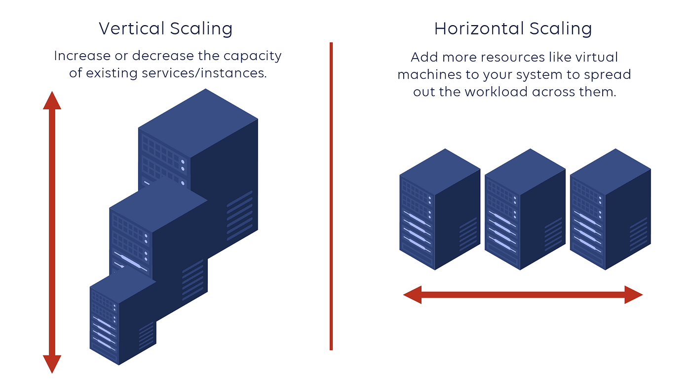
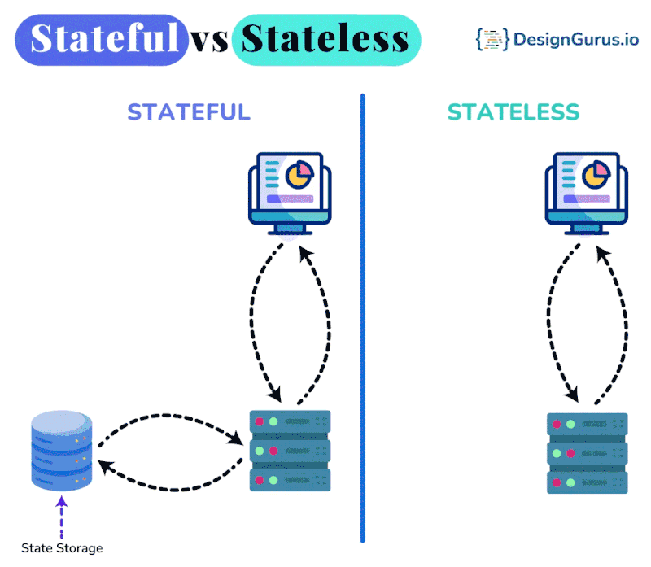
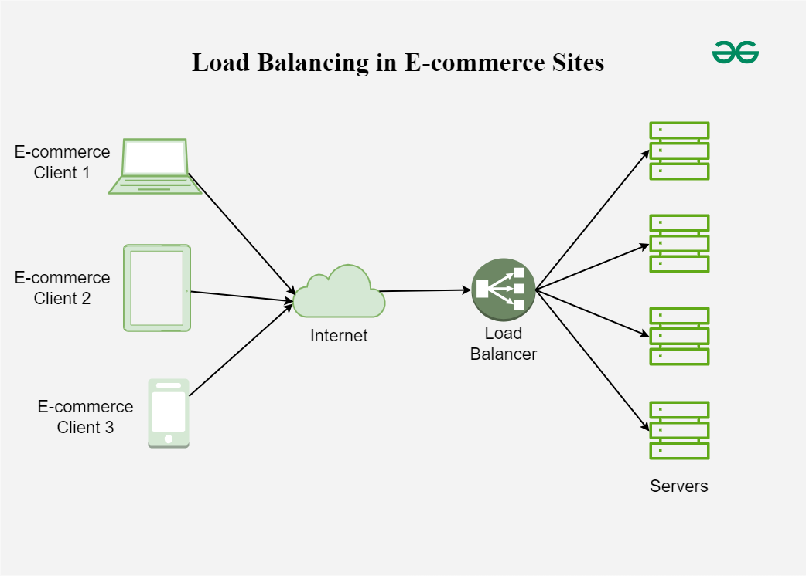

# Escalabilidade

---

## Vertical scaling

> Vertical scaling (scale-up) consiste em aumentar os recursos de uma máquina existente para aumentar sua capacidade de processamento.

Exemplos:

* Mais CPU
* Mais memória RAM
* Mais armazenamento
* CPU mais potente

**Vantagens:**

* Simplicidade
* Menor complexidade de distribuição
* Pode exigir poucas alterações na aplicação

**Desvantagens:**

* Limite físico do hardware
* Pode exigir máquinas mais caras
* Normalmente não resolve o problema de redundância

---

## Horizontal scaling

> Horizontal scaling (scale-out) consiste em adicionar múltiplas máquinas ou instâncias para distribuir a carga do sistema.

```text
             +--> [Instance 1]
             |
[Load Balancer] --> [Instance 2]
             |
             +--> [Instance 3]
```

**Vantagens:**

* Permite aumentar a capacidade adicionando instâncias
* Pode fornecer redundância
* Permite distribuir a carga
* Facilita escalabilidade automática

**Desvantagens:**

* Maior complexidade
* Exige distribuição de carga
* Pode exigir gerenciamento de estado
* Sistemas distribuídos introduzem novos problemas

---

## Scale-up vs scale-out

> Scale-up é aumentar a capacidade de uma máquina existente, enquanto scale-out é aumentar a capacidade adicionando mais máquinas ou instâncias.



Os termos são frequentemente utilizados como sinônimos de:

* **Scale-up** → Vertical scaling
* **Scale-out** → Horizontal scaling

---

## Stateless vs Stateful

> Um sistema stateless não depende de informações armazenadas localmente na instância para processar uma requisição. Um sistema stateful mantém estado associado à instância ou sessão.

### Stateless

```text
Request 1 ──> [Instance A]
Request 2 ──> [Instance B]
Request 3 ──> [Instance C]
```

Qualquer instância pode processar qualquer requisição.

O estado necessário deve ser armazenado em um componente externo, como:

* Banco de dados
* Cache
* Session store
* Object storage

### Stateful

```text
User ──> [Instance A]
          └── Session / State
```

O processamento depende do estado mantido pela própria instância.

**Stateless facilita horizontal scaling**, pois as requisições podem ser distribuídas livremente entre as instâncias.



---

## Bottlenecks

> Bottleneck é um componente ou recurso que limita a capacidade ou o desempenho de todo o sistema.

Exemplo:

```text
[API]
  |
  v
[Application]
  |
  v
[Database]  ← Bottleneck
```

Mesmo que os outros componentes tenham capacidade para processar mais requisições, o throughput do sistema ficará limitado pelo componente que não consegue acompanhar a demanda.

Bottlenecks comuns:

* CPU
* Memória
* Banco de dados
* Rede
* Disco
* Serviços externos
* Locks e contenção
* Limites de conexão

A identificação de bottlenecks normalmente exige métricas e observabilidade.

---

## Single point of failure — SPOF

> Single Point of Failure (SPOF) é um componente cuja falha pode causar a indisponibilidade de todo ou parte crítica do sistema.

Exemplo:

```text
[Load Balancer]
      |
      v
[Single Database] ← SPOF
```

Se o banco falhar, todo o sistema pode ficar indisponível.

A eliminação de SPOFs normalmente envolve:

* Redundância
* Replicação
* Failover
* Múltiplas zonas de disponibilidade
* Múltiplas regiões, quando necessário

```text
             +--> [Database A]
[Application]-+
             +--> [Database B]
```


---

## Load distribution

> Load distribution é a distribuição da carga de trabalho entre múltiplos recursos para evitar que um único componente fique sobrecarregado.

Um mecanismo comum é o **Load Balancer**:

```text
                    +--> [Instance 1]
                    |
[Clients] --> [Load Balancer] --> [Instance 2]
                    |
                    +--> [Instance 3]
```

O Load Balancer pode distribuir requisições utilizando diferentes estratégias, como:

* Round Robin
* Least Connections
* Weighted routing
* IP Hash

A distribuição eficiente da carga depende da capacidade dos recursos, do padrão de tráfego e da natureza das requisições.



---

<div style="display: flex; justify-content: space-between;">

[← Capacidade e estimativas](./1.2-capacity-estimatives.md)

[Modelos arquiteturais →](./1.4-architecture-models.md)

</div>