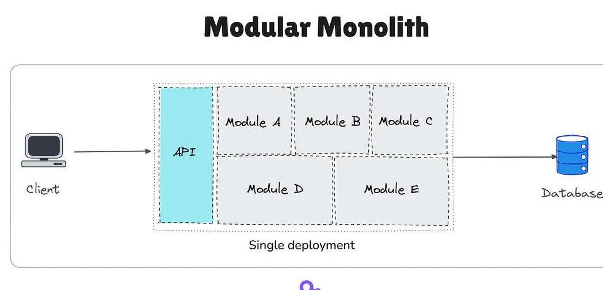
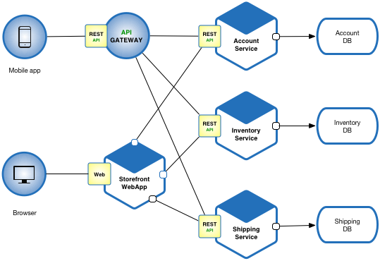
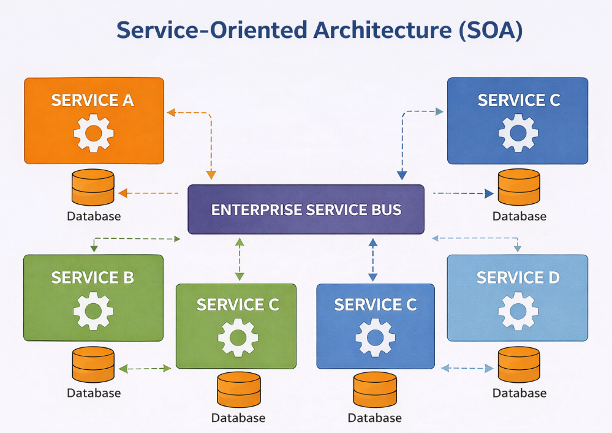
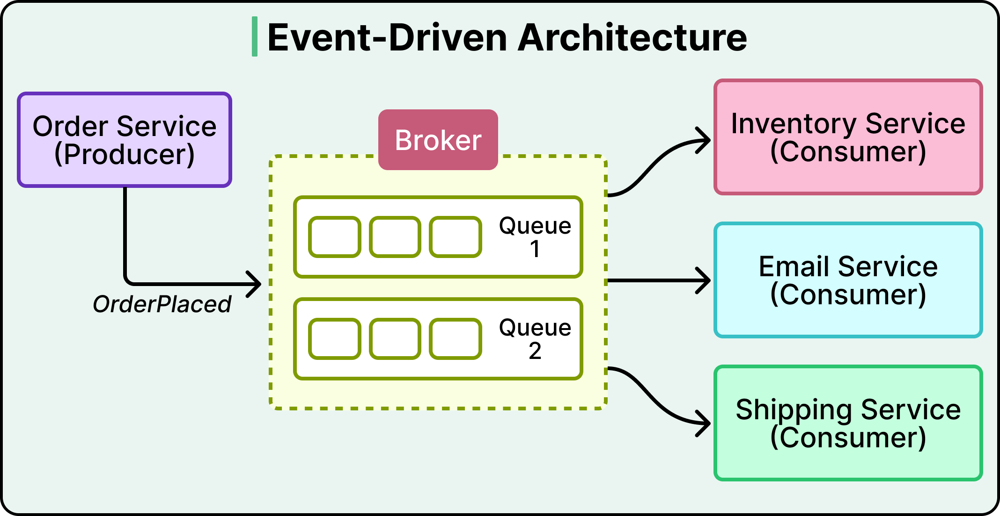
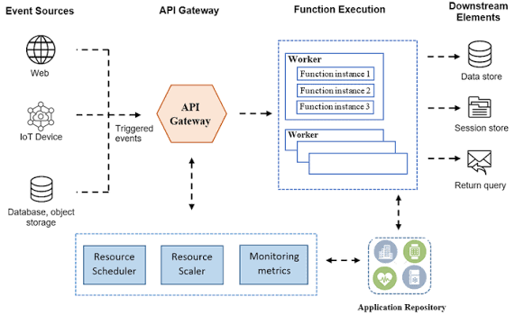
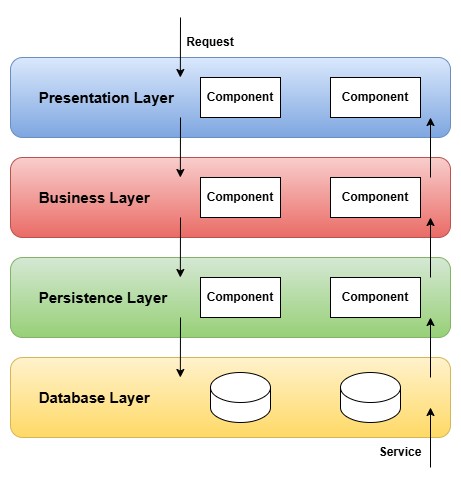
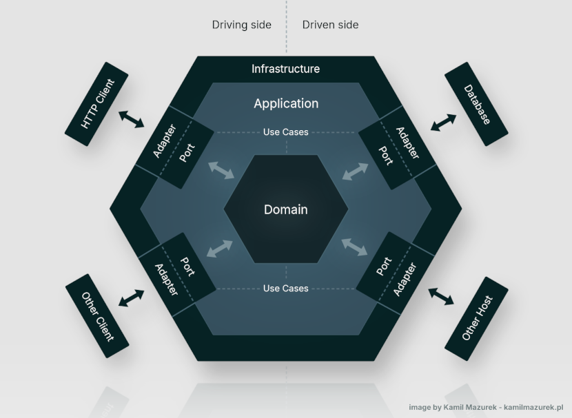
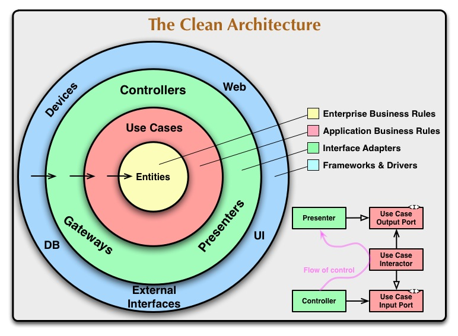

# Modelos arquiteturais

---

## Monolith

> Arquitetura em que a aplicação é desenvolvida e implantada como uma única unidade executável.

Todos os componentes da aplicação normalmente compartilham o mesmo processo, infraestrutura e ciclo de deploy.

**Vantagens:**

* Simplicidade de desenvolvimento e deploy, gerando rapidez inicial
* Menor complexidade operacional
* Comunicação entre componentes geralmente ocorre em memória
* Transações podem ser mais simples

**Desvantagens:**

* Escalabilidade de componentes individualmente limitada
* Alterações exigem normalmente o deploy da aplicação inteira
* Falhas podem afetar toda a aplicação
* O código pode se tornar difícil de manter conforme cresce

---

## Modular monolith

> Arquitetura em que a aplicação continua sendo implantada como uma única unidade, mas é internamente dividida em módulos com responsabilidades e limites bem definidos.

Os módulos devem minimizar dependências e comunicação direta entre suas implementações internas.

**Vantagens:**

* Mantém a simplicidade operacional de um monolith
* Permite separação clara de responsabilidades
* Facilita testes e manutenção
* Pode ser posteriormente dividido em serviços independentes

**Desvantagens:**

* Continua sendo uma única unidade de deploy
* Módulos compartilham recursos da aplicação
* Escalabilidade individual continua limitada
* Exige disciplina para evitar acoplamento entre módulos

---

## Microservices

> Arquitetura em que uma aplicação é dividida em pequenos serviços independentes, cada um responsável por uma capacidade de negócio específica.

Cada serviço pode possuir seu próprio processo, ciclo de deploy e infraestrutura.

A comunicação entre serviços ocorre normalmente através de HTTP, gRPC ou mensageria.

**Vantagens:**

* Deploy independente
* Escalabilidade independente
* Isolamento de falhas entre serviços
* Times podem trabalhar de forma independente
* Serviços podem utilizar tecnologias diferentes

**Desvantagens:**

* Maior complexidade operacional
* Comunicação pela rede
* Distribuição de dados e transações
* Observabilidade mais complexa
* Mais pontos de falha
* Maior custo de infraestrutura

---

## SOA

> SOA (Service-Oriented Architecture/Arquitetura Orientada a Serviços) é um modelo arquitetural que organiza funcionalidades de negócio como serviços reutilizáveis e relativamente independentes, normalmente integrados através de contratos bem definidos.

SOA e Microservices possuem conceitos semelhantes, mas possuem objetivos e características diferentes. SOA tradicionalmente utiliza serviços mais abrangentes e uma forte preocupação com integração e reutilização corporativa.

**Características comuns:**

* Serviços orientados a capacidades de negócio
* Contratos de comunicação bem definidos
* Integração entre sistemas
* Reutilização de serviços
* Governança centralizada em muitas implementações

---

## Event-driven architecture

> Event-driven architecture é um modelo em que componentes do sistema se comunicam principalmente através da produção e consumo de eventos.

Um evento representa algo que já aconteceu no sistema.

O produtor não precisa conhecer diretamente todos os consumidores do evento.

**Vantagens:**

* Baixo acoplamento entre componentes
* Processamento assíncrono
* Facilidade para adicionar novos consumidores
* Boa escalabilidade
* Permite integração entre sistemas

**Desvantagens:**

* Maior complexidade de debugging
* Consistência eventualmente pode ser necessária
* Processamento duplicado deve ser tratado
* Ordenação e entrega de eventos podem ser problemas
* Operação do message broker adiciona complexidade

---

## Serverless

> Serverless é um modelo em que a infraestrutura necessária para executar o código é gerenciada pelo provedor de cloud, permitindo que o desenvolvedor se concentre principalmente na lógica da aplicação.

O termo não significa que não existem servidores, mas que o gerenciamento deles é abstraído do desenvolvedor.

Exemplo:

Funções serverless normalmente são executadas sob demanda e podem escalar automaticamente.

**Vantagens:**

* Não exige gerenciamento direto de servidores
* Escalabilidade automática
* Pagamento baseado no uso em muitos modelos
* Bom para workloads event-driven e operações de curta duração

**Desvantagens:**

* Cold starts (atraso na inicialização)
* Limitações de execução
* Vendor lock-in (dependência do fornecedor)
* Debugging e observabilidade podem ser mais complexos
* Custos podem crescer significativamente em workloads contínuos

---

## Layered architecture

> Layered architecture organiza a aplicação em camadas, onde cada camada possui uma responsabilidade específica e normalmente depende apenas das camadas abaixo dela.

Uma estrutura comum:

Cada camada abstrai detalhes das camadas inferiores.

**Vantagens:**

* Simples de compreender
* Separação de responsabilidades
* Facilita manutenção
* Estrutura familiar para aplicações corporativas

**Desvantagens:**

* Pode gerar forte acoplamento entre camadas
* Mudanças podem atravessar várias camadas
* Pode resultar em lógica de negócio espalhada
* Não garante automaticamente uma boa separação arquitetural

---

## Hexagonal architecture

> Hexagonal architecture (Ports and Adapters) organiza a aplicação colocando a lógica de negócio no centro e isolando-a de tecnologias e sistemas externos através de portas (ports) e adaptadores (adapters).

**Ports** definem as interfaces que a aplicação utiliza ou disponibiliza.

**Adapters** implementam essas interfaces para conectar a aplicação a tecnologias externas.

**Vantagens:**

* Domínio isolado de detalhes externos
* Facilita testes
* Permite trocar tecnologias
* Reduz acoplamento com frameworks e infraestrutura

**Desvantagens:**

* Mais abstrações
* Pode adicionar complexidade a aplicações simples
* Exige disciplina para manter os limites

---

## Clean Architecture

> Clean Architecture organiza o sistema em camadas concêntricas, colocando as regras de negócio no centro e fazendo as dependências apontarem para dentro.

Uma divisão comum:

* **Entities / Domain** — regras de negócio fundamentais/regras corporativas base
* **Use Cases / Application** — regras específicas da aplicação
* **Interface Adapters** — conversão entre modelos internos e externos
* **Frameworks & Drivers** — banco, HTTP, frameworks, ferramentas externas

O princípio central é a **Dependency Rule**:

> Código interno não deve depender de detalhes externos. Detalhes devem depender das abstrações definidas pelas camadas internas.

**Vantagens:**

* Forte isolamento das regras de negócio
* Alta testabilidade
* Reduz dependência de frameworks
* Facilita substituição de detalhes externos
* Favorece manutenção a longo prazo

**Desvantagens:**

* Maior quantidade de abstrações e código
* Pode ser overengineering para aplicações pequenas
* Exige disciplina arquitetural

### Relação com Hexagonal Architecture

Clean Architecture e Hexagonal Architecture possuem objetivos semelhantes: **isolar o domínio e a lógica da aplicação dos detalhes externos através da inversão de dependências**.

A diferença está principalmente na forma de organizar e descrever a arquitetura. Hexagonal utiliza o modelo de **Ports and Adapters**, enquanto Clean Architecture apresenta uma organização em **camadas concêntricas**.

---