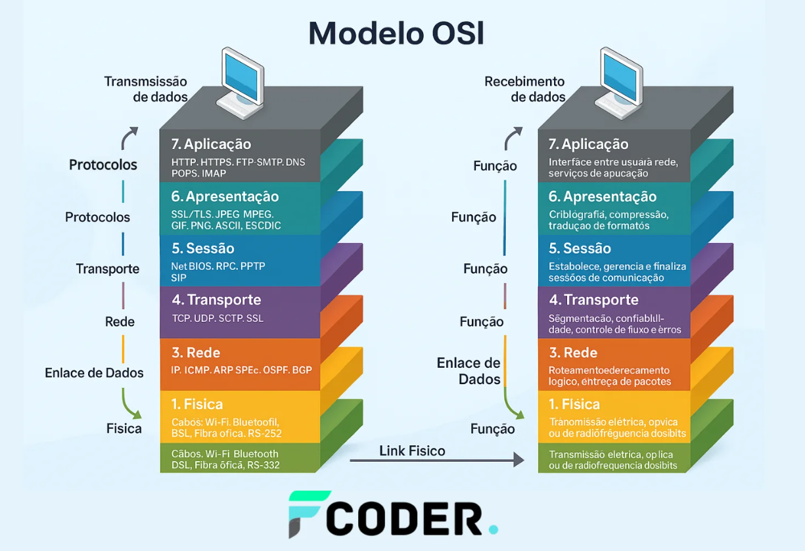
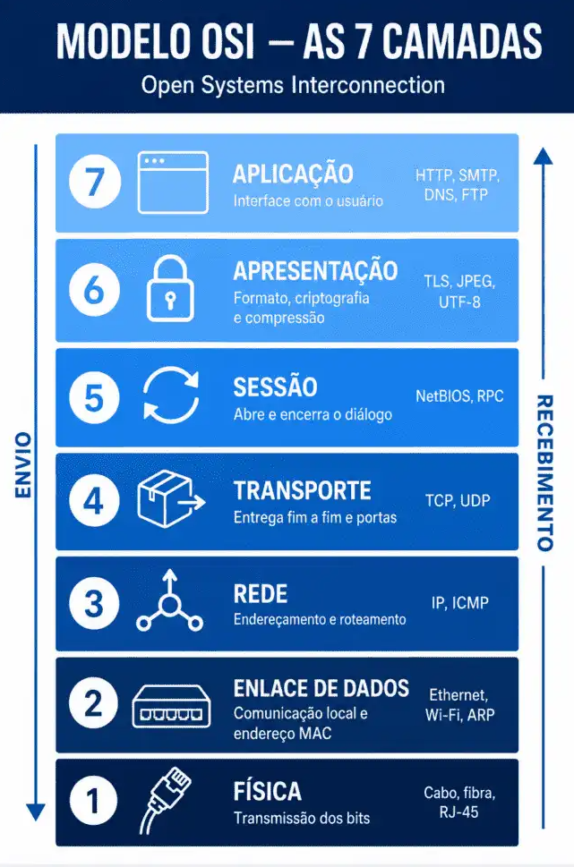
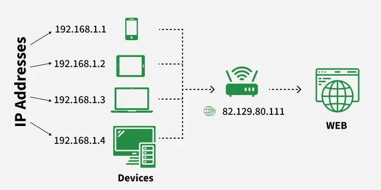
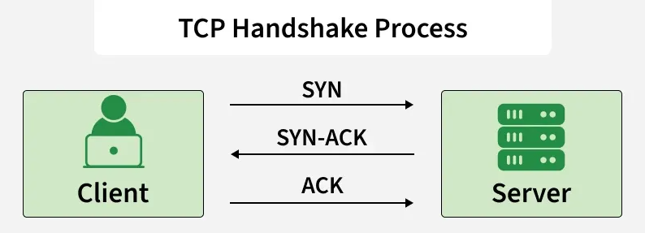
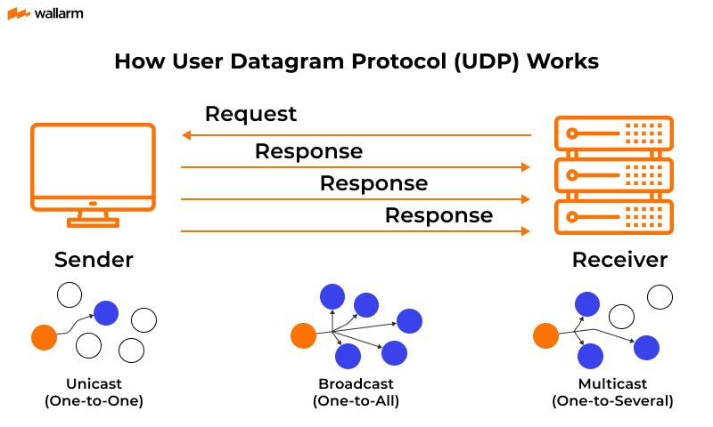
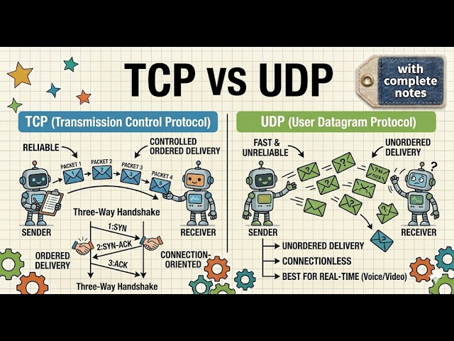
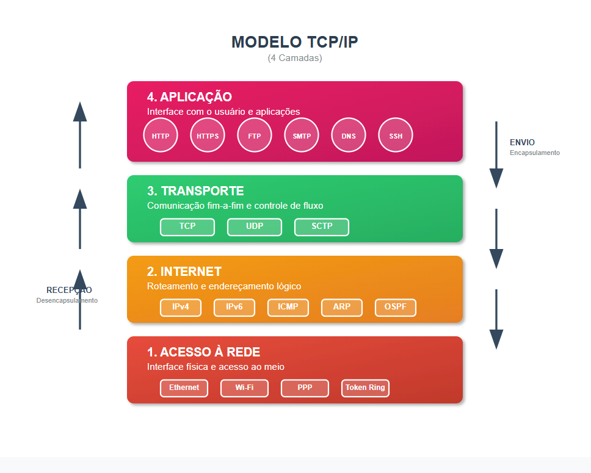

# Fundamentos de rede

---

## OSI (Open Systems Interconnection)

> Modelo conceitual que divide a comunicação de rede em sete camadas.

| Camada | Nome            | Responsabilidade |
|---|-----------------|---|
| 7 | Application     | Comunicação entre aplicações |
| 6 | Presentation    | Formatação, codificação e criptografia |
| 5 | Session         | Gerenciamento de sessões |
| 4 | Transport       | Comunicação fim a fim |
| 3 | Network         | Endereçamento e roteamento |
| 2 | Data Link | Comunicação entre dispositivos na mesma rede |
| 1 | Physical        | Transmissão dos bits |



O modelo OSI é principalmente utilizado como referência conceitual para estudar redes.



---

## IP

> IP (Internet Protocol) é responsável pelo endereçamento lógico e encaminhamento de pacotes entre redes.

Principais versões:

- **IPv4:** endereços de 32 bits, como `192.168.1.10`
- **IPv6:** endereços de 128 bits, como `2001:db8::1`

O IP utiliza um modelo **best effort**: não garante entrega, ordenação ou ausência de duplicação dos pacotes.

Essas garantias podem ser fornecidas por protocolos superiores, como TCP.

### IP público vs privado

- **IP privado:** utilizado dentro de redes privadas.
- **IP público:** utilizado para comunicação através da Internet.

### IP estático vs dinâmico

**IP estático** é manualmente configurado, terá mesmo valor para o aparelho em toda sessão.

- Vantagens: Bom para hospedar sites, acesso remoto ou câmeras de segurança.
- Desvantagens: Mais difícil de configurar e costuma ser mais caro.

**IP dinâmico** numero dado por um Servidor DHCP que muda sozinho de vez em quando.

- Vantagens: Padrão das casas, fácil de usar e não tem custo extra.
- Desvantagens: Difícil rastrear o aparelho, acessos remotos e servidores sem programas extras.



DHCP (Dynamic Host Configuration Protocol): é um protocolo de rede que atribui automaticamente endereços IP e configurações de conexão para os aparelhos que entram em uma rede.

---

## TCP

> TCP (Transmission Control Protocol) é um **PROTOCOLO DE TRANSPORTE** orientado à conexão que fornece entrega confiável e ordenada de dados.

Características:

- Orientado à conexão
- Entrega confiável
- Ordenação dos dados
- Retransmissão de dados perdidos
- Controle de fluxo
- Controle de congestionamento

### Three-way handshake

Antes da transmissão de dados, o TCP estabelece uma conexão:



- SYN (Synchronize)
- SYN-ACK (Synchronize and Acknowlege)
- ACK (Acknowlege)

Após a conexão, inicia-se a transmissão dos dados da seguinte forma:

1. **Segmentação**: TCP quebra a informação em partes menores e coloca um número de sequência em cada. Envia vários de uma vez.
2. **Confirmação (ACK)**: o destinatário ordena com base no número de sequência e responde com ACK (ex: "Recebi o 1 e o 2, pode mandar o 3").
3. **Retransmissão**: Se um pedaço sumir ou o ACK demorar a voltar, o remetente reenvia aquele pedaço específico.

Utilizado em protocolos como:

- HTTP/1.1
- HTTP/2
- PostgreSQL
- Redis
- RabbitMQ

---

## UDP

> UDP (User Datagram Protocol) é um protocolo de transporte sem conexão que não garante entrega, ordenação ou retransmissão dos dados, priorizando a velocidade em vez da confiabilidade.

Características:

- Sem estabelecimento de conexão
- Baixo overhead
- Sem garantia de entrega
- Sem garantia de ordenação
- Sem retransmissão automática



1. UDP não estabelece conexão prévia, apenas empacota a informação e joga na rede a um endereço e porta previamente definidos.
2. Os dados são dividos em unidades independentes (datagramas), que viajam de forma autônoma pela rede, somente com informações essenciais:
- Porta de origem e destino
- Tamanho do pacote
- Checksum para validação se a informação foi corrompida
3. Receptor fica ouvindo uma porta específica, conforme os pacotes chegam ele os processa.

Por não gastar tempo confirmando recebimento de pacotes e controlando fluxo, UDP tem uma latência muito baixa, sendo utilizada em casos de real-time, onde é melhor perder uma informação do que congelar.

Exemplos de utilização:

- DNS
- Streaming
- Jogos online
- Comunicação em tempo real
- QUIC

### TCP vs UDP



---

## TCP/IP

> O TCP/IP é o conjunto fundamental de regras de comunicação que permite que computadores e outros dispositivos se conectem e troquem dados na internet.

1. O sistema divide os dados em pedaços menores chamados pacotes.
2. O **IP** cuida do endereço e do roteamento para garantir que o pacote vá do computador de origem para o destino correto.
3. O **TCP** garante que todos os pacotes cheguem em ordem e sem erros, remontando a mensagem original no destino

| Camada | Exemplos |
|---|---|
| Application | HTTP, DNS, SMTP |
| Transport | TCP, UDP |
| Internet | IP |
| Network Access | Ethernet, Wi-Fi |



O modelo TCP/IP organiza a comunicação em quatro etapas ou camadas:

- **Aplicação**: Onde interagem os programas do usuário, como navegadores e leitores de e-mail (usando protocolos como HTTP e FTP).
- **Transporte**: Onde o TCP e o UDP controlam a entrega correta ou rápida dos pacotes.
- **Internet (ou Rede)**: Onde o IP atua para rotear os dados entre diferentes redes.
- **Acesso à Rede (ou Enlace)**: Onde ocorre a transmissão física dos dados pelos cabos ou Wi-Fi.

## Vantagens do TCP/IP

- **Padronização:** protocolos abertos facilitam a integração entre dispositivos e softwares.
- **Interoperabilidade:** permite comunicação entre diferentes equipamentos, redes e sistemas.
- **Flexibilidade:** suporta diferentes protocolos e necessidades de comunicação.
- **Escalabilidade:** funciona em redes de diferentes portes, de LANs a WANs.
- **Confiabilidade:** mecanismos de verificação e retransmissão permitem transferência confiável de dados.

## Desvantagens do TCP/IP

- **Complexidade:** redes grandes podem exigir configurações e gerenciamento complexos.
- **Sobrecarga:** mecanismos de confiabilidade podem aumentar o overhead, especialmente em transmissões pequenas.
- **Desempenho:** pode apresentar overhead desnecessário em redes pequenas ou aplicações que priorizam baixa latência.
- **Segurança:** o modelo original não foi projetado com segurança como requisito central, exigindo mecanismos adicionais como TLS.

O modelo TCP/IP é mais próximo da implementação prática das redes atuais.

---

## Portas

> Portas identificam serviços ou endpoints de comunicação em um dispositivo.

O intervalo de portas é de `0` a `65535`.

Exemplos:

| Porta | Uso comum |
|---|---|
| 22 | SSH |
| 53 | DNS |
| 80 | HTTP |
| 443 | HTTPS |
| 5432 | PostgreSQL |
| 6379 | Redis |
| 5672 | RabbitMQ |

```text
192.168.1.10:8080
       |      |
       IP     Porta
```

O IP identifica o dispositivo, enquanto a porta identifica o serviço de destino.

---

## DNS

> DNS (Domain Name System) traduz nomes de domínio em informações utilizadas para localizar serviços, principalmente endereços IP.

```text
www.example.com
       |
       v
DNS Resolution
       |
       v
93.184.216.34
```

### Registros comuns

| Registro | Função |
|---|---|
| A | Domínio → IPv4 |
| AAAA | Domínio → IPv6 |
| CNAME | Alias para outro domínio |
| MX | Servidores de e-mail |
| NS | Servidores DNS autoritativos |
| TXT | Informações textuais |

### DNS Cache

Resoluções DNS podem ser armazenadas em cache para reduzir latência e quantidade de consultas.

O **TTL (Time to Live)** determina por quanto tempo uma informação pode permanecer em cache.

### Uso em System Design

DNS pode ser utilizado para:

- Service discovery
- Failover
- Distribuição geográfica
- Direcionamento de tráfego
- Load balancing baseado em DNS

---

## ARP

> ARP (Address Resolution Protocol) associa um endereço IPv4 (lógico) a um endereço MAC (físico) dentro de uma rede local.

```text
Host A                         Host B

IP: 192.168.1.10               IP: 192.168.1.20
MAC: AA:AA                     MAC: BB:BB

"Quem possui 192.168.1.20?"
             |
             v
        ARP Request
             |
             v
        ARP Reply
             |
             v
IP → MAC armazenado em cache
```

O ARP é utilizado em redes IPv4.

Em IPv6, o mecanismo equivalente é o **Neighbor Discovery Protocol (NDP)**.

---

## Routing

> Routing é o processo de determinar o caminho que os pacotes devem seguir entre redes.

Roteadores utilizam tabelas de roteamento para determinar o próximo salto.

```text
[Client]
   |
   v
[Router A]
   |
   v
[Router B]
   |
   v
[Server]
```

### Tabela de roteamento

Exemplo simplificado:

| Rede de destino | Próximo salto |
|---|---|
| `192.168.1.0/24` | Rede local |
| `10.0.0.0/8` | Router interno |
| `0.0.0.0/0` | Gateway padrão |

O roteamento influencia:

- Latência
- Disponibilidade
- Conectividade
- Isolamento de redes
- Comunicação entre regiões

---

## NAT

> NAT (Network Address Translation) traduz endereços IP entre redes, permitindo principalmente que dispositivos de uma rede privada compartilhem um endereço IP público.

Um caso comum é o **PAT (Port Address Translation)**, que utiliza portas para diferenciar conexões.

```text
192.168.1.10:5000
        |
        v
      [NAT]
        |
        v
203.0.113.10:40001
        |
        v
   [Internet]
```

### Utilizações

- Compartilhamento de IP público
- Acesso à Internet por redes privadas
- Tradução entre redes
- Isolamento de endereços internos

NAT não é um mecanismo de segurança equivalente a um firewall.

---

## Resumo

| Conceito | Responsabilidade |
|---|---|
| OSI | Modelo conceitual de camadas |
| IP | Endereçamento e encaminhamento |
| TCP | Transporte confiável e ordenado |
| UDP | Transporte sem conexão |
| TCP/IP | Arquitetura de protocolos da Internet |
| Portas | Identificação de serviços |
| DNS | Resolução de nomes |
| ARP | IPv4 → MAC na rede local |
| Routing | Caminho dos pacotes |
| NAT | Tradução de endereços |

## Imagens sugeridas

<!-- PLACEHOLDER: Diagrama comparando OSI e TCP/IP -->

<!-- PLACEHOLDER: Diagrama do TCP three-way handshake -->

<!-- PLACEHOLDER: Diagrama de resolução DNS -->

<!-- PLACEHOLDER: Diagrama de NAT entre rede privada e Internet -->

---

<div style="display: flex; justify-content: space-between;">

[← Redes e comunicação](./2.0-networks.md)

[HTTP →](./2.2-http.md)

</div>