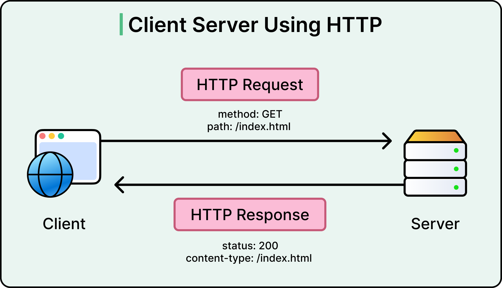
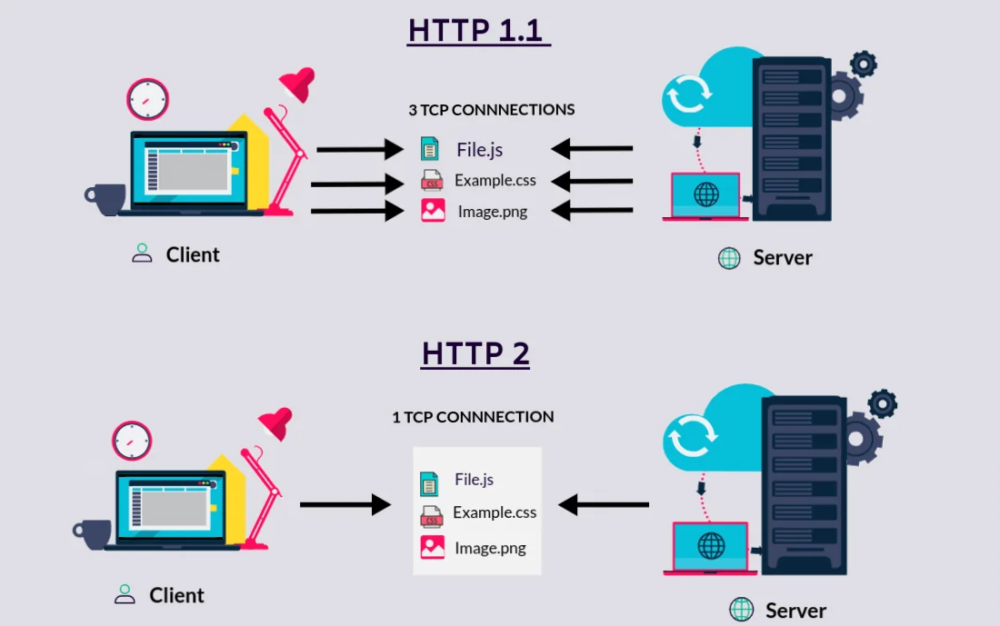
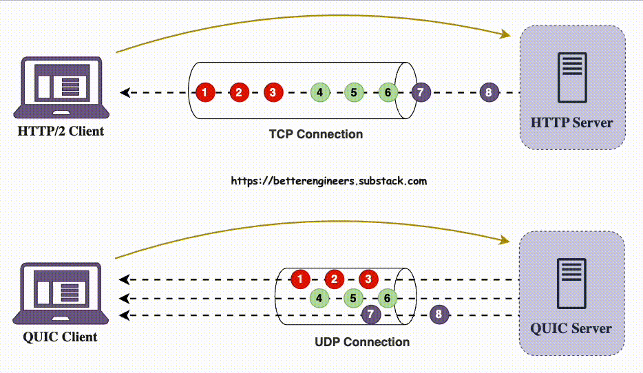

# HTTP

---

HTTP (**Hypertext Transfer Protocol**) é o protocolo utilizado para comunicação entre clientes e servidores na Web.

Ele define como uma requisição é enviada e como uma resposta é retornada.



Uma comunicação HTTP normalmente contém:

```text
Request
├── Method
├── URL
├── Headers
└── Body

Response
├── Status Code
├── Headers
└── Body
```

Exemplo:

```http
GET /users/123 HTTP/1.1
Host: api.example.com
Accept: application/json
Authorization: Bearer token
```

Resposta:

```http
HTTP/1.1 200 OK
Content-Type: application/json

{
  "id": 123,
  "name": "Marcos"
}
```

---

## HTTP/1.1

HTTP/1.1 é uma das versões mais utilizadas historicamente do protocolo.

Principais características:

* Comunicação baseada em texto
* Request/Response
* Headers
* Métodos HTTP
* Status codes
* Persistent connections
* `Keep-Alive`
* `Chunked Transfer Encoding`

Exemplo:

```http
GET /users HTTP/1.1
Host: api.example.com
Connection: keep-alive
```

### Limitação principal

Embora permita reutilizar uma conexão TCP, as requisições na mesma conexão são essencialmente processadas em sequência.

Isso pode gerar **Head-of-Line Blocking**:

```text
Request 1 ────────────────> Response 1
Request 2 ────────────────> Response 2
Request 3 ────────────────> Response 3
```

Se uma resposta demora, as seguintes podem ser afetadas.

HTTP/2 foi desenvolvido para resolver grande parte desses problemas.

---

## HTTP/2

HTTP/2 mantém o modelo HTTP, mas altera a forma como as mensagens são transportadas.

Principais características:

* Multiplexação
* Comunicação binária
* Compressão de headers
* Uma conexão TCP pode transportar várias requisições simultaneamente
* HTTP/2 normalmente utiliza TLS na Internet

### Multiplexação

Em vez de precisar esperar uma requisição terminar para processar outra:

```text
HTTP/1.1

Request A ───────────> Response A
Request B ───────────> Response B
Request C ───────────> Response C
```

HTTP/2 permite múltiplos streams na mesma conexão:

```text
HTTP/2

Request A ──────────────> Response A
Request B ────────> Response B
Request C ───────────────> Response C

          mesma conexão TCP
```

Os dados são divididos em frames e podem ser intercalados.



### HPACK

HTTP/2 utiliza **HPACK** para comprimir headers.

Isso reduz o volume de dados transmitidos quando headers são repetidos em várias requisições.

---

## HTTP/3

HTTP/3 utiliza **QUIC** (Quick UDP Internet Connections) em vez de TCP.



QUIC implementa mecanismos de transporte como:

* Conexões
* Confiabilidade
* Controle de congestionamento
* Criptografia
* Multiplexação

### Por que UDP?

UDP permite que o QUIC implemente esses mecanismos sem depender das limitações do TCP.

Uma vantagem importante é evitar o **Head-of-Line Blocking entre streams** causado pelo transporte TCP.

Se um pacote de um stream for perdido, isso não precisa bloquear a entrega de dados de outros streams.

### Comparação

| Característica             | HTTP/1.1 | HTTP/2            | HTTP/3            |
| -------------------------- | -------- | ----------------- | ----------------- |
| Transporte                 | TCP      | TCP               | QUIC/UDP          |
| Formato                    | Texto    | Binário           | Binário           |
| Multiplexação              | Não      | Sim               | Sim               |
| Compressão de headers      | Não      | HPACK             | QPACK             |
| Head-of-Line no transporte | Sim      | Sim               | Não               |
| TLS                        | Opcional | Normalmente usado | Integrado ao QUIC |

---

# Métodos HTTP

Os métodos definem a operação desejada sobre um recurso.

| Método  | Uso comum                          |
| ------- | ---------------------------------- |
| GET     | Consultar recurso                  |
| POST    | Criar recurso ou executar operação |
| PUT     | Substituir/atualizar recurso       |
| PATCH   | Atualizar parcialmente             |
| DELETE  | Remover recurso                    |
| HEAD    | Obter headers sem o body           |
| OPTIONS | Consultar capacidades/opções       |

### GET

Utilizado para obter dados.

```http
GET /users/123
```

GET deve ser **safe**, ou seja, sua execução não deve alterar o estado do recurso.

### POST

Normalmente utilizado para criação ou execução de uma operação.

```http
POST /users
```

```json
{
  "name": "Marcos"
}
```

POST normalmente não é idempotente.

### PUT

Normalmente utilizado para substituir completamente um recurso.

```http
PUT /users/123
```

```json
{
  "name": "Marcos",
  "email": "marcos@example.com"
}
```

PUT é **idempotente**.

### PATCH

Atualiza parcialmente um recurso.

```http
PATCH /users/123
```

```json
{
  "email": "novo@example.com"
}
```

PATCH pode ou não ser idempotente, dependendo da operação.

### DELETE

Remove um recurso.

```http
DELETE /users/123
```

DELETE é definido como idempotente, embora a resposta possa variar entre chamadas.

---

## Safe e Idempotent

Esses conceitos são importantes principalmente para retries.

### Safe

Uma operação **safe** não deve alterar o estado do servidor.

Exemplo:

```text
GET
HEAD
OPTIONS
```

### Idempotent

Uma operação é **idempotente** quando executar a mesma operação várias vezes produz o mesmo efeito final que executá-la uma vez.

```text
PUT /users/123
```

Executar uma vez:

```text
name = Marcos
```

Executar novamente:

```text
name = Marcos
```

O estado final continua o mesmo.

Isso é importante em sistemas distribuídos porque uma requisição pode precisar ser reenviada após timeout.

---

# Status Codes

O status code informa o resultado da requisição.

## 1xx — Informativo

Indica informações intermediárias.

Exemplos:

```text
100 Continue
101 Switching Protocols
```

---

## 2xx — Sucesso

Indica que a requisição foi processada com sucesso.

| Status | Significado |
| ------ | ----------- |
| 200    | OK          |
| 201    | Created     |
| 202    | Accepted    |
| 204    | No Content  |

Exemplos:

```http
GET /users/123
200 OK
```

```http
POST /users
201 Created
```

`202 Accepted` é útil quando a requisição foi aceita, mas o processamento ainda ocorrerá de forma assíncrona.

---

## 3xx — Redirecionamento

Indica que o cliente precisa seguir outra localização ou pode utilizar uma informação armazenada em cache.

| Status | Significado        |
| ------ | ------------------ |
| 301    | Moved Permanently  |
| 302    | Found              |
| 304    | Not Modified       |
| 307    | Temporary Redirect |
| 308    | Permanent Redirect |

`304 Not Modified` é utilizado em conjunto com mecanismos de cache.

---

## 4xx — Erro do cliente

Indica um problema relacionado à requisição.

| Status | Significado        |
| ------ | ------------------ |
| 400    | Bad Request        |
| 401    | Unauthorized       |
| 403    | Forbidden          |
| 404    | Not Found          |
| 405    | Method Not Allowed |
| 409    | Conflict           |
| 429    | Too Many Requests  |

### 401 vs 403

```text
401 → autenticação necessária ou inválida
403 → identidade conhecida, mas acesso não permitido
```

### 429

Indica que o cliente excedeu algum limite de requisições.

É comum em sistemas que possuem **rate limiting**.

---

## 5xx — Erro do servidor

Indica falha no processamento do lado do servidor.

| Status | Significado           |
| ------ | --------------------- |
| 500    | Internal Server Error |
| 502    | Bad Gateway           |
| 503    | Service Unavailable   |
| 504    | Gateway Timeout       |

### 502

Normalmente ocorre quando um proxy ou gateway recebe uma resposta inválida de outro servidor.

```text
Client
   |
   v
Gateway
   |
   X
Backend
```

### 503

Indica que o serviço está temporariamente indisponível.

Pode ocorrer durante:

* manutenção
* sobrecarga
* ausência de instâncias disponíveis
* falhas de dependências

### 504

O gateway/proxy não recebeu uma resposta dentro do timeout esperado.

---

# Headers

Headers carregam metadados sobre a requisição ou resposta.

Exemplo:

```http
GET /users HTTP/1.1
Host: api.example.com
Accept: application/json
Authorization: Bearer token
Accept-Encoding: gzip
```

Resposta:

```http
HTTP/1.1 200 OK
Content-Type: application/json
Content-Length: 1234
Cache-Control: max-age=60
Content-Encoding: gzip
```

Headers comuns:

| Header           | Função                             |
| ---------------- | ---------------------------------- |
| Host             | Host solicitado                    |
| Content-Type     | Tipo do conteúdo                   |
| Content-Length   | Tamanho do body                    |
| Accept           | Tipos aceitos pelo cliente         |
| Authorization    | Credenciais/token                  |
| Cookie           | Cookies enviados                   |
| Set-Cookie       | Criação/alteração de cookie        |
| Cache-Control    | Regras de cache                    |
| ETag             | Identificador de versão do recurso |
| Last-Modified    | Data da última alteração           |
| Accept-Encoding  | Compressões aceitas                |
| Content-Encoding | Compressão utilizada               |
| User-Agent       | Identificação do cliente           |
| Location         | URL de redirecionamento            |

---

# Cookies

Cookies permitem que o servidor armazene pequenos dados associados ao cliente.

O servidor pode enviar:

```http
Set-Cookie: sessionId=abc123; HttpOnly; Secure
```

O navegador posteriormente envia:

```http
Cookie: sessionId=abc123
```

Cookies são utilizados para:

* Sessões
* Autenticação
* Preferências
* Rastreamento
* Identificação do cliente

### Atributos importantes

**HttpOnly**

Impede acesso ao cookie através de JavaScript.

Ajuda a reduzir o impacto de determinados ataques XSS.

**Secure**

O cookie só deve ser enviado através de HTTPS.

**SameSite**

Controla quando o cookie pode ser enviado em requisições cross-site.

Valores comuns:

```text
Strict
Lax
None
```

Cookies devem ser considerados parte importante da arquitetura de autenticação baseada em sessão.

---

# Keep-Alive

Em HTTP/1.1, conexões TCP podem ser reutilizadas para várias requisições.

Sem reutilização:

```text
Request → TCP connection → Response
Request → TCP connection → Response
Request → TCP connection → Response
```

Com conexão persistente:

```text
TCP connection
     |
     +── Request → Response
     +── Request → Response
     +── Request → Response
```

Isso evita criar uma nova conexão TCP para cada requisição.

Benefícios:

* Menor latência
* Menor overhead
* Menor quantidade de handshakes
* Menor consumo de recursos

HTTP/2 e HTTP/3 utilizam conexões persistentes como parte do seu modelo de transporte.

---

# Connection Pooling

**Connection Pooling** mantém um conjunto de conexões abertas para reutilização.

Em uma aplicação:

```text
Application
     |
     v
Connection Pool
 ┌────┬────┬────┬────┐
 │ C1 │ C2 │ C3 │ C4 │
 └────┴────┴────┴────┘
     |
     v
Server
```

Em vez de criar uma conexão a cada requisição, a aplicação obtém uma conexão disponível do pool.

Isso é especialmente importante para:

* HTTP clients
* Bancos de dados
* Redis
* Outros serviços TCP

### Exemplo

Sem pooling:

```text
Request
  ↓
Criar conexão
  ↓
Enviar request
  ↓
Receber response
  ↓
Fechar conexão
```

Com pooling:

```text
Request
  ↓
Obter conexão do pool
  ↓
Enviar request
  ↓
Receber response
  ↓
Devolver conexão ao pool
```

O pool normalmente possui limites como:

```text
maximum connections
minimum idle connections
connection timeout
idle timeout
```

Um pool configurado incorretamente pode se tornar um gargalo.

---

# Compression

Compressão reduz a quantidade de dados transmitidos pela rede, acelerando carregamentos.

O cliente informa o que suporta:

```http
Accept-Encoding: gzip, br
```

O servidor pode responder:

```http
Content-Encoding: gzip
```

Exemplo:

```text
JSON original
     ↓
  100 KB
     ↓
Compressão
     ↓
   20 KB
     ↓
Rede
```

Benefícios:

* Menor bandwidth
* Menor tempo de transferência
* Menor custo de rede

Existe um trade-off:

```text
Mais compressão
    ↓
Menos dados transmitidos
    ↓
Mais CPU
```

Algoritmos comuns:

* gzip: mais antigo, extremamente compatível. Baixa taxa de compressão e velocidade moderada.
* Brotli (`br`): Alta taxa de compressão (ideal para arquivos estáticos) e velocidade mais lenta para níveis máximos. Boa compatibilidade na web moderna.
* Zstandard (`zstd`, dependendo do ambiente): Alta taxa de compressão (próxima a Brotli) e velocidade extremamente rápida. Compatibilidade em crescimento.

Compressão costuma ser especialmente útil para:

* JSON
* HTML
* CSS
* JavaScript
* Texto

Conteúdo já comprimido, como JPEG e muitos formatos de vídeo, normalmente apresenta pouco benefício adicional.

---

# Chunked Transfer Encoding

O **Chunked Transfer Encoding** permite enviar o body em partes sem conhecer antecipadamente seu tamanho total.

Exemplo conceitual:

```text
Server
  |
  | chunk 1
  | chunk 2
  | chunk 3
  | chunk 4
  v
Client
```


Em HTTP/1.1:

```http
Transfer-Encoding: chunked
```

Isso é útil quando o servidor produz dados progressivamente.

Exemplo:

```text
Processamento
     ↓
gera parte dos dados
     ↓
envia chunk
     ↓
continua processamento
     ↓
envia próximo chunk
```

Assim, o servidor não precisa montar todo o conteúdo antes de começar a enviar.

### Importante

Chunked transfer encoding é uma característica do HTTP/1.1.

HTTP/2 e HTTP/3 possuem seus próprios mecanismos de framing e não utilizam `Transfer-Encoding: chunked` da mesma forma.

---

# Streaming

Streaming permite enviar ou receber dados progressivamente, sem esperar que todo o conteúdo esteja disponível.

Sem streaming:

```text
Server
  |
  | processa tudo
  |
  |=======================> Response
```

Com streaming:

```text
Server
  |
  |=====> chunk
  |=====> chunk
  |=====> chunk
  |=====> chunk
  |
Client
```

Isso é útil para:

* Vídeos
* Arquivos grandes
* Eventos em tempo real
* Logs
* Exportações
* Respostas geradas progressivamente

O streaming reduz o tempo até o cliente receber os primeiros dados e evita que o servidor precise manter todo o conteúdo em memória antes de começar a resposta.

Tecnologias específicas de comunicação em tempo real, como SSE e WebSocket, serão abordadas posteriormente.

---

# HTTP e arquitetura distribuída

Em sistemas distribuídos, HTTP normalmente aparece entre diferentes componentes:

```text
Client
   |
   v
Load Balancer
   |
   v
API
   |
   +------> Service A
   |
   +------> Service B
   |
   +------> Database
```

Cada comunicação pode introduzir:

* Latência
* Timeout
* Retry
* Connection pooling
* Falhas de rede
* Rate limiting
* Circuit breaker
* Compressão

Por isso, uma chamada HTTP entre serviços não deve ser tratada como uma chamada local.

```text
Método local:
A → B

Rede:
A → rede → B
       ↑
   pode falhar
```

Esse conceito será aprofundado nos capítulos de comunicação síncrona/assíncrona e sistemas distribuídos.

---

## Resumo

| Conceito           | Função                                        |
| ------------------ | --------------------------------------------- |
| HTTP/1.1           | HTTP baseado em texto e conexões persistentes |
| HTTP/2             | Multiplexação e protocolo binário sobre TCP   |
| HTTP/3             | HTTP sobre QUIC/UDP                           |
| Methods            | Definem a operação desejada                   |
| Status Codes       | Informam o resultado da requisição            |
| Headers            | Transportam metadados                         |
| Cookies            | Mantêm informações associadas ao cliente      |
| Keep-Alive         | Reutiliza conexões                            |
| Connection Pooling | Mantém conexões disponíveis para reutilização |
| Compression        | Reduz o tamanho dos dados                     |
| Chunked Transfer   | Envia body em partes no HTTP/1.1              |
| Streaming          | Permite transmitir dados progressivamente     |

---

## Pontos importantes para System Design

* HTTP/1.1 pode sofrer limitações de paralelismo.
* HTTP/2 permite multiplexação sobre uma conexão TCP.
* HTTP/3 utiliza QUIC sobre UDP.
* Métodos idempotentes são importantes para estratégias de retry.
* Headers carregam informações fundamentais de autenticação, cache, compressão e conteúdo.
* Keep-Alive reduz o custo de estabelecer conexões.
* Connection pooling evita criar conexões repetidamente.
* Compressão reduz bandwidth, mas aumenta uso de CPU.
* Streaming permite começar a transmitir antes de todo o conteúdo estar pronto.
* HTTP não elimina falhas de rede: timeout, retry e circuit breaker continuam sendo importantes.

---

<div style="display: flex; justify-content: space-between;">

[← Redes](./2.0-networks.md)

[HTTPS →](./2.3-https.md)

</div>
