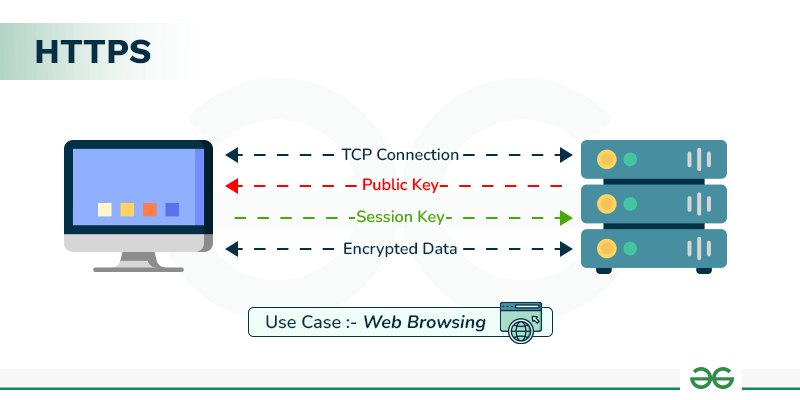
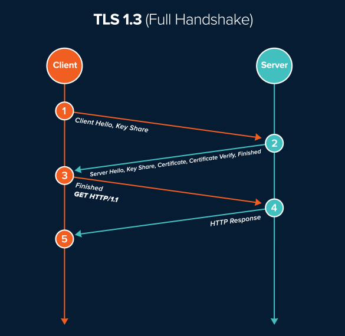
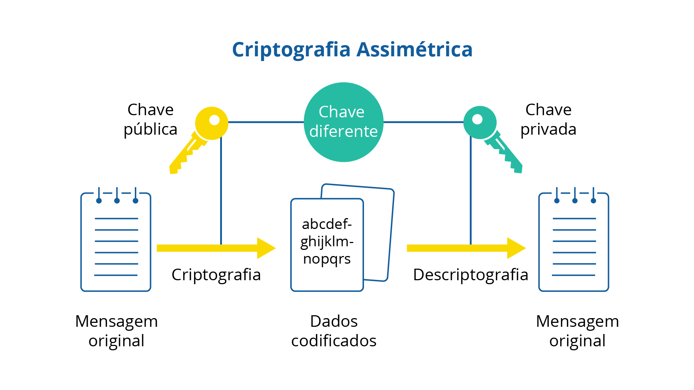
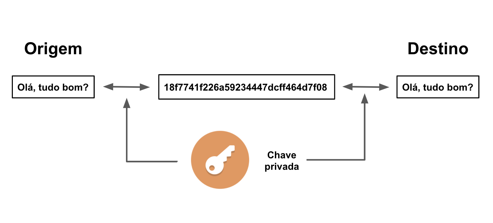

# HTTPS

---

HTTPS (HTTP Secure) é o uso do protocolo HTTP sobre uma conexão protegida por **TLS (Transport Layer Security)**.

O objetivo principal é proteger a comunicação entre cliente e servidor contra:

* Interceptação dos dados
* Alteração dos dados durante o transporte
* Impersonação do servidor

A estrutura básica é:

```text
Client
   |
   | HTTPS
   |
   v
 TLS
   |
   v
 HTTP
   |
   v
 Server
```



HTTPS não é um protocolo completamente diferente do HTTP. O HTTP continua sendo responsável pela comunicação de aplicação, enquanto o TLS cria uma camada de segurança para essa comunicação.

---

## TLS

TLS é o protocolo responsável por estabelecer uma conexão segura entre duas partes.

Ele fornece principalmente:

* **Confidencialidade/Criptografia** — terceiros não conseguem ler os dados transmitidos.
* **Integridade** — alterações nos dados podem ser detectadas.
* **Autenticação** — normalmente permite verificar a identidade do servidor.

Handshake: No início da conexão, onde o cliente e o servidor conversam para definir as regras de segurança e criar chaves de criptografia exclusivas para aquela sessão



---

## Certificados

Um certificado digital é utilizado para associar uma identidade a uma **chave pública**.

Um certificado HTTPS normalmente contém informações como:

```text
Domínio:
example.com

Chave pública:
...

Autoridade certificadora:
Let's Encrypt

Período de validade:
...

Assinatura digital:
...
```

O certificado é emitido por uma **Certificate Authority (CA)**.

Exemplos de CAs:

* Let's Encrypt
* DigiCert
* GlobalSign

O navegador possui uma lista de CAs confiáveis.

Quando acessamos:

```text
https://example.com
```

o servidor apresenta seu certificado.

O cliente verifica, entre outras coisas:

1. Se o certificado é válido.
2. Se não está expirado.
3. Se o domínio corresponde ao certificado.
4. Se foi assinado por uma CA confiável.
5. Se a cadeia de certificados é válida.

### Cadeia de confiança

Um certificado normalmente faz parte de uma cadeia:

```text
Root CA
   |
   v
Intermediate CA
   |
   v
Certificado do servidor
   |
   v
example.com
```

A confiança no certificado do servidor é construída a partir das CAs confiáveis instaladas no sistema operacional ou navegador.

---

## Chaves públicas e privadas

TLS utiliza criptografia assimétrica e simétrica.

Na criptografia assimétrica existem duas chaves relacionadas:

```text
Chave pública
     |
     | pode ser compartilhada
     v
   Público

Chave privada
     |
     | deve permanecer protegida
     v
   Servidor
```

A chave pública pode ser distribuída através do certificado.

A chave privada deve permanecer exclusivamente sob controle do servidor.

### Criptografia assimétrica

Uma propriedade importante é que operações envolvendo a chave pública e privada possuem relação matemática.

De forma simplificada:

```text
Public Key  → disponível para qualquer pessoa

Private Key → mantida em segredo
```



A criptografia assimétrica é importante para autenticação e estabelecimento inicial de segurança, mas normalmente não é utilizada para criptografar toda a comunicação HTTPS devido ao seu custo computacional.

---

## Criptografia simétrica

Depois que a conexão segura é estabelecida, a comunicação normalmente utiliza uma chave simétrica compartilhada.

```text
Client
  |
  | chave de sessão
  |
  v
Server
```



A mesma chave é utilizada para proteger os dados enviados nas duas direções.

A criptografia simétrica é muito mais eficiente para grandes volumes de dados.

Por isso, HTTPS combina os dois modelos:

```text
Criptografia assimétrica
        |
        | autenticação
        | estabelecimento inicial
        v
Chave de sessão
        |
        v
Criptografia simétrica
        |
        v
Dados HTTP
```

---

## Handshake

Antes de transmitir os dados HTTP, cliente e servidor precisam estabelecer uma conexão TLS.

Esse processo é chamado de **TLS Handshake**.

De forma simplificada:

```text
Client                         Server
  |                              |
  | ClientHello                  |
  |----------------------------->|
  |                              |
  | ServerHello                  |
  | Certificate                  |
  |<-----------------------------|
  |                              |
  | valida certificado           |
  |                              |
  | estabelece chaves            |
  |                              |
  | Finished                     |
  |<---------------------------->|
  |                              |
  |====== HTTP criptografado ===>|
  |<===== HTTP criptografado ====|
```

O processo real depende da versão do TLS e dos algoritmos utilizados.

No TLS 1.3, por exemplo, o handshake foi simplificado em relação a versões anteriores, reduzindo a quantidade de mensagens necessárias para estabelecer a conexão.

---

## Estabelecimento da chave de sessão

Durante o handshake, cliente e servidor estabelecem uma chave compartilhada.

Um mecanismo comum é baseado em **Diffie-Hellman**, especialmente suas variantes modernas como ECDHE.

A ideia é permitir que:

```text
Client
   |
   | informações públicas
   |
   v
Server
```

consigam chegar ao mesmo segredo compartilhado sem transmitir diretamente esse segredo pela rede.

De forma simplificada:

```text
Client                    Server
  |                         |
  | parâmetros públicos     |
  |------------------------>|
  |<------------------------|
  |                         |
  | calcula segredo         |
  |                         |
  |<---- mesmo segredo ---->|
```

Esse segredo é utilizado para derivar as chaves simétricas da sessão.

---

## Encryption

Depois do handshake, os dados HTTP são transmitidos de forma criptografada.

Sem HTTPS:

```text
Client
  |
  | GET /usuario
  | Authorization: ...
  | dados...
  |
  v
Internet
```

Um intermediário que conseguisse interceptar a comunicação poderia visualizar os dados.

Com HTTPS:

```text
Client
  |
  | dados criptografados
  | ##################
  | ##################
  |
  v
Internet
  |
  | ##################
  |
  v
Server
```

Um intermediário pode observar que existe uma comunicação, mas não consegue simplesmente interpretar o conteúdo protegido pelo TLS.

---

## Integridade

HTTPS também protege contra alterações dos dados durante o transporte.

Por exemplo:

```text
Client
  |
  | "valor=100"
  |
  v
Internet
  |
  X alteração
  |
  | "valor=999"
  |
  v
Server
```

O TLS utiliza mecanismos criptográficos de autenticação dos dados para detectar alterações.

Se os dados forem modificados durante o transporte, a conexão pode identificar que o conteúdo não corresponde ao que foi enviado.

---

## Autenticação do servidor

HTTPS também ajuda o cliente a verificar se está realmente se comunicando com o servidor esperado.

Por exemplo:

```text
https://banco.com
```

O servidor apresenta um certificado associado ao domínio.

O cliente verifica:

```text
Certificado
     |
     +-- domínio correto?
     |
     +-- expirado?
     |
     +-- CA confiável?
     |
     +-- cadeia válida?
     |
     v
Conexão confiável
```

Isso dificulta que um atacante simplesmente se apresente como o servidor legítimo.

---

## O que HTTPS protege?

HTTPS protege principalmente os dados **em trânsito**.

```text
Client
   |
   | HTTPS
   | 🔒
   v
Server
```

Ele não protege automaticamente:

* Dados armazenados no banco
* Dados armazenados no servidor
* Um servidor comprometido
* Uma aplicação vulnerável
* Credenciais armazenadas de forma insegura
* Dados expostos antes de serem enviados para o TLS

Por exemplo:

```text
Client
   |
   | HTTPS
   v
Load Balancer
   |
   | HTTP interno
   v
Application
```

Nesse cenário, o tráfego entre cliente e Load Balancer está protegido, mas o tráfego interno pode não estar.

Para proteger também a comunicação interna, pode-se utilizar TLS entre os serviços:

```text
Client
   |
   | HTTPS
   v
Load Balancer
   |
   | HTTPS
   v
Service A
   |
   | HTTPS
   v
Service B
```

Esse conceito é importante em arquiteturas distribuídas e pode levar ao uso de **mTLS (mutual TLS)**.

---

## TLS Termination

Em uma arquitetura comum, o TLS pode ser encerrado no Load Balancer ou em um reverse proxy.

```text
Client
   |
   | HTTPS
   v
Load Balancer
   |
   | HTTP
   v
Application
```

O Load Balancer realiza:

```text
TLS
 ↓
descriptografa
 ↓
HTTP
 ↓
Application
```

Isso simplifica o gerenciamento de certificados nas aplicações.

Outra possibilidade é manter TLS até o serviço:

```text
Client
   |
   | HTTPS
   v
Load Balancer
   |
   | HTTPS
   v
Application
```

A escolha depende dos requisitos de segurança e da arquitetura.

---

## HTTPS em System Design

HTTPS normalmente é considerado obrigatório para APIs e aplicações que transportam dados pela internet.

Em um System Design, decisões relacionadas a HTTPS incluem:

* Onde ocorre o TLS termination?
* Onde os certificados são armazenados?
* Como os certificados são renovados?
* O tráfego interno também precisa de TLS?
* É necessário mTLS?
* Qual versão do TLS será utilizada?
* Como Load Balancers e reverse proxies serão configurados?

Uma arquitetura comum:

```text
                Internet
                    |
                  HTTPS
                    |
                    v
              Load Balancer
                    |
             TLS Termination
                    |
                    v
              Spring Boot
                    |
                  HTTPS
                    |
                    v
               Database
```

---

<div style="display: flex; justify-content: space-between;">

[← HTTP](./2.2-http.md)

[APIs →](./2.4-apis.md)

</div>
