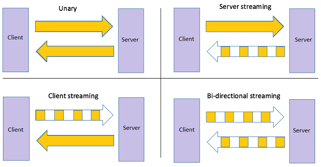
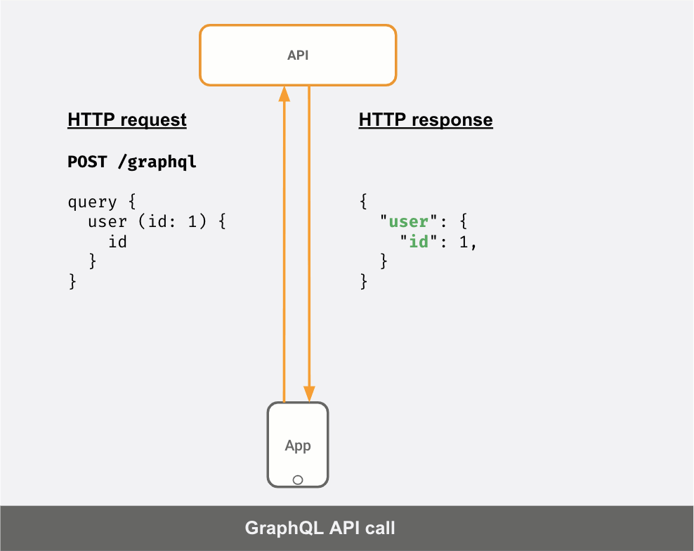
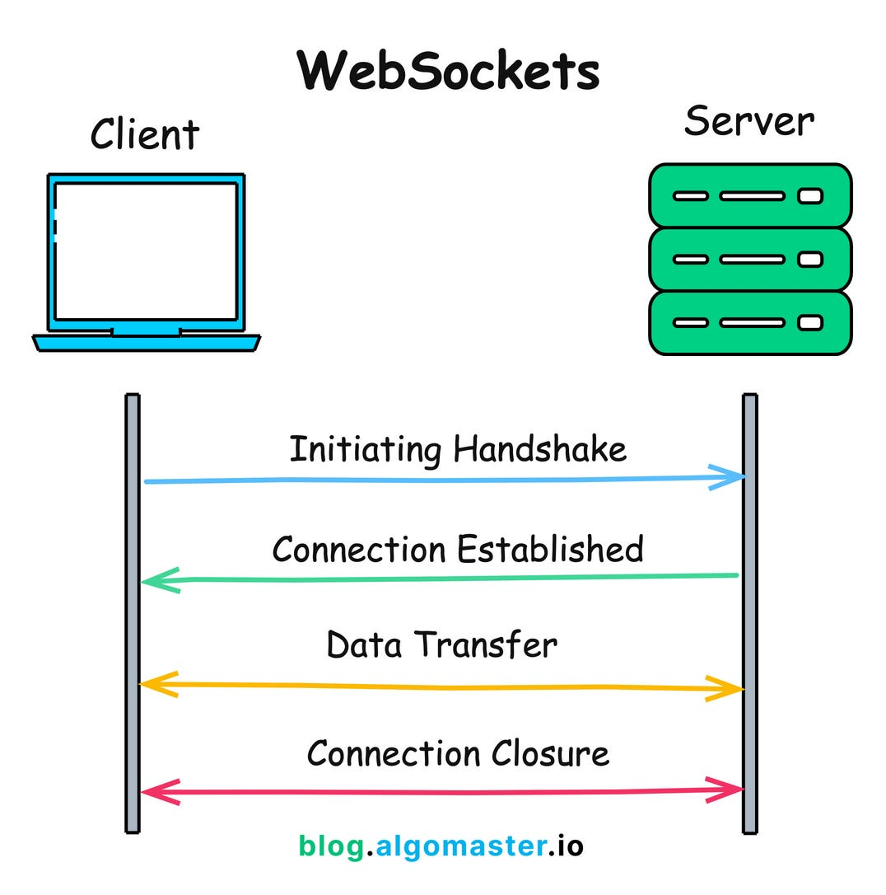
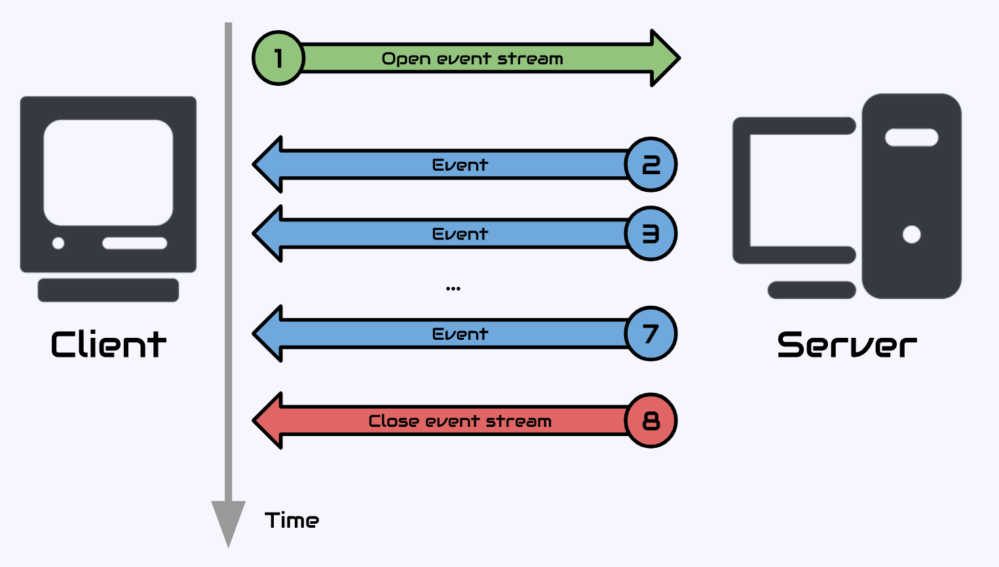
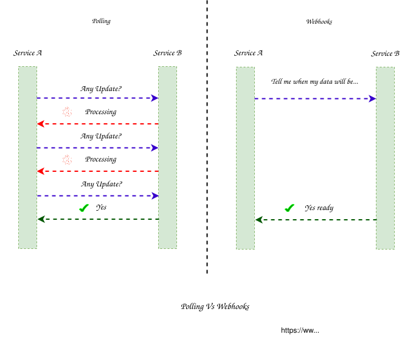

# APIs

---

API (Application Programming Interface) define uma forma padronizada, conjunto de regras e protocolos, que permite a comunicação entre diferentes softwares de forma simples e segura.

Em uma arquitetura distribuída, uma API pode permitir comunicação entre:

```text
Client
   |
   | API
   v
Backend
   |
   | API
   v
Outro serviço
```

Existem diferentes modelos de comunicação. Os principais abordados neste documento são:

* REST
* SOAP
* RPC
* gRPC
* GraphQL
* WebSocket
* SSE
* Webhooks

Cada modelo possui características diferentes e atende a necessidades diferentes.

---

## REST

REST (Representational State Transfer) é um estilo arquitetural baseado principalmente em recursos e HTTP.

Uma API REST normalmente representa entidades como recursos:

```text
/users
/users/123
/products
/products/456
/orders
/orders/789
```

As operações são realizadas utilizando os métodos HTTP:

```text
GET     /users/123
POST    /users
PUT     /users/123
PATCH   /users/123
DELETE  /users/123
```

Exemplo:

```http
GET /users/123 HTTP/1.1
Host: api.example.com
```

Resposta:

```http
HTTP/1.1 200 OK
Content-Type: application/json

{
  "id": 123,
  "name": "João"
}
```

### Características

Uma API REST normalmente possui:

* HTTP como protocolo de transporte
* Recursos identificados por URLs
* Métodos HTTP para representar operações
* Status codes HTTP
* Representações como JSON
* Comunicação stateless

### Stateless

Em uma API REST, cada requisição deve conter as informações necessárias para que o servidor a processe.

```text
Request 1
  |
  v
Server

Request 2
  |
  v
Server
```

O servidor não deve depender de uma sessão armazenada localmente em uma instância específica para processar a segunda requisição.

Isso facilita o uso de múltiplas instâncias:

```text
             Load Balancer
                  |
        +---------+---------+
        |         |         |
        v         v         v
     Server A  Server B  Server C
```

---

## SOAP

SOAP (Simple Object Access Protocol) é um protocolo para comunicação entre sistemas, tradicionalmente utilizado em **Web Services**.

Diferentemente de uma API REST, que normalmente utiliza recursos HTTP e JSON, SOAP utiliza **mensagens estruturadas em XML** e possui um contrato formal para definir as operações disponíveis.

Exemplo de uma requisição SOAP:

```xml
<soap:Envelope>
    <soap:Body>
        <GetUser>
            <UserId>123</UserId>
        </GetUser>
    </soap:Body>
</soap:Envelope>
```

A resposta também utiliza XML:

```xml
<soap:Envelope>
    <soap:Body>
        <GetUserResponse>
            <User>
                <Id>123</Id>
                <Name>João</Name>
            </User>
        </GetUserResponse>
    </soap:Body>
</soap:Envelope>
```

### WSDL

SOAP normalmente utiliza **WSDL (Web Services Description Language)** para descrever o serviço.

O WSDL define informações como:

* Operações disponíveis
* Parâmetros
* Tipos de dados
* Formato das mensagens
* Endpoint do serviço

Conceitualmente:

```text
             WSDL
               |
       +-------+-------+
       |               |
       v               v
    Cliente          Servidor
       |               |
       +---- SOAP -----+
              |
             XML
```

Isso permite que ferramentas gerem automaticamente código cliente e servidor a partir do contrato.

### Características

SOAP possui algumas características importantes:

* Mensagens em XML
* Contrato formal através de WSDL
* Estrutura padronizada de mensagens
* Suporte a diferentes mecanismos de transporte
* Extensões para segurança, transações e outras necessidades corporativas

Embora seja frequentemente utilizado sobre HTTP, SOAP não depende exclusivamente de HTTP.

### SOAP vs REST

| Característica   | SOAP                            | REST                         |
| ---------------- | ------------------------------- | ---------------------------- |
| Modelo           | Operações                       | Recursos                     |
| Formato comum    | XML                             | JSON                         |
| Contrato         | WSDL                            | OpenAPI, documentação etc.   |
| Protocolo        | SOAP                            | Estilo arquitetural          |
| HTTP             | Pode ser utilizado              | Normalmente utilizado        |
| Tipagem/contrato | Forte                           | Mais flexível                |
| Complexidade     | Maior                           | Geralmente menor             |
| Uso comum        | Sistemas corporativos e legados | APIs web e serviços modernos |

SOAP ainda pode ser encontrado em sistemas corporativos, integrações bancárias, ERPs, sistemas governamentais e outros ambientes onde contratos formais e padrões de integração específicos são importantes.

Em um System Design, SOAP normalmente aparece como **restrição de integração com um sistema existente**, e não necessariamente como a primeira escolha para uma API nova.

---

## RPC

RPC (Remote Procedure Call) representa a comunicação como uma chamada de procedimento ou operação remota.

Em vez de pensar principalmente em recursos, a API pode ser modelada como ações:

```text
createUser()
getUser()
calculatePrice()
processPayment()
cancelOrder()
```

Exemplo conceitual:

```text
Client
   |
   | calculatePrice(...)
   v
Server
   |
   | resultado
   v
Client
```

A ideia é tornar uma chamada remota semelhante, conceitualmente, a uma chamada de função local.

Uma API RPC pode utilizar diferentes protocolos e formatos de comunicação.

```text
RPC
 |
 +-- HTTP
 +-- TCP
 +-- outros transportes
```

RPC é um conceito arquitetural. **gRPC é uma implementação específica de RPC.**

---

## gRPC

gRPC é um framework de RPC desenvolvido pelo Google.

Ele utiliza principalmente:

* HTTP/2
* Protocol Buffers (Protobuf) - formato do Google para serializar dados estruturados de forma binária, compacta e extremamente rápida.
* Contratos definidos em arquivos `.proto`

Um serviço pode ser definido assim:

```protobuf
service UserService {
  rpc GetUser(GetUserRequest) returns (User);
}
```

As mensagens também são definidas no contrato:

```protobuf
message GetUserRequest {
  int64 id = 1;
}

message User {
  int64 id = 1;
  string name = 2;
}
```

A partir desse contrato, ferramentas do gRPC podem gerar código para cliente e servidor.

```text
             .proto
                |
        +-------+-------+
        |               |
        v               v
   Client Stub      Server Code
        |               |
        +-------+-------+
                |
              gRPC
                |
            HTTP/2
```

### Vantagens

* Velocidade
* Comunicação eficiente
* Contrato fortemente tipado
* Geração automática de código
* Suporte a streaming
* Bom encaixe para comunicação entre serviços

### Streaming

gRPC suporta diferentes modelos de comunicação:

```text
Unary

Client ---- request ----> Server
Client <--- response ---- Server
```

```text
Server Streaming

Client ---- request ----> Server
Client <--- response ---- Server
Client <--- response ---- Server
Client <--- response ---- Server
```

```text
Client Streaming

Client ---- request ----> Server
Client ---- request ----> Server
Client ---- request ----> Server
Client <--- response ---- Server
```

```text
Bidirectional Streaming

Client ---- request ----> Server
Client <--- response ---- Server
Client ---- request ----> Server
Client <--- response ---- Server
```



**Unary**: modelo clássico de requisição e resposta (Request/Response): o cliente envia uma única requisição e o servidor responde com uma única resposta.

1. **CRUD convencional**: GetProduct, CreateUser, DeleteOrder
2. **Autenticação/Autorização**: Processamento de login, validação de tokens JWT ou verificação de permissões de acesso.
3. **Payment API/Checkout**: O cliente envia os dados do carrinho e do cartão de crédito de uma só vez, e o servidor processa e retorna o sucesso ou falha da transação.
4. **Comunicação interna de microserviços**: Consultas diretas onde um serviço precisa de uma informação pontual de outro para continuar o fluxo

**Server Streaming**: O cliente envia uma única requisição e o servidor responde com um fluxo contínuo (stream) de múltiplos dados/respostas

1. **Cotações financeiras real-time**: O cliente pede o preço de uma ação e o servidor envia atualizações contínuas sempre que o preço muda.
2. **Downloads/Logs real-time**: O cliente solicita um arquivo pesado ou a leitura de um arquivo de log, e o servidor vai enviando em pedaços (chunks).
3. **Monitoring/Progresso**:  Acompanhar o status ou a porcentagem de conclusão de uma tarefa longa no servidor (ex: processamento de vídeo ou backup).

**Client Streaming**:

1. **Uploads de arquivos grandes**: O cliente fatia um arquivo grande em vários blocos e os envia sequencialmente; o servidor confirma apenas quando o upload total termina.
2. **Envio de telemetria ou métricas em lote**: Dispositivos IoT ou aplicações móveis enviam um fluxo contínuo de dados de sensores/localização para o backend acumular e salvar de uma só vez.

**Bidirectional Streaming**:

1. **Chat e mensagens instantâneas**: Aplicativos de bate-papo onde usuários mandam e recebem mensagens em tempo real na mesma sessão.
2. **Jogos multiplayer em tempo real**: Envio de comandos do jogador para o servidor e recebimento da posição de outros jogadores instantaneamente.
3. **Dashboards colaborativos e controle remoto**: Ferramentas onde comandos e atualizações visuais de múltiplos usuários trafegam instantaneamente de ida e volta

### REST vs gRPC

Uma comparação simplificada:

| Característica      | REST                       | gRPC                      |
| ------------------- | -------------------------- | ------------------------- |
| Modelo              | Recursos                   | Procedimentos/serviços    |
| Transporte comum    | HTTP/1.1 ou HTTP/2         | HTTP/2                    |
| Formato comum       | JSON                       | Protobuf                  |
| Contrato            | OpenAPI, documentação etc. | `.proto`                  |
| Tipagem             | Geralmente mais flexível   | Fortemente tipado         |
| Browser             | Excelente suporte          | Mais limitado diretamente |
| Comunicação interna | Muito comum                | Muito comum               |
| Streaming           | Possível                   | Suporte nativo            |

A escolha depende do contexto. REST é frequentemente utilizado para APIs públicas e comunicação com clientes, enquanto gRPC pode ser interessante para comunicação interna entre serviços.

---

## GraphQL

GraphQL é uma linguagem de consulta e uma especificação para APIs.

Em uma API REST, o servidor normalmente define os recursos e o formato das respostas:

```text
GET /users/123
GET /users/123/orders
GET /users/123/profile
```

No GraphQL, o cliente especifica os dados que deseja.

Exemplo:

```graphql
query {
  user(id: 123) {
    id
    name
    orders {
      id
      total
    }
  }
}
```

O servidor retorna os campos solicitados:

```json
{
  "data": {
    "user": {
      "id": 123,
      "name": "João",
      "orders": [
        {
          "id": 10,
          "total": 150.00
        }
      ]
    }
  }
}
```

### Schema

GraphQL utiliza um schema que define os tipos disponíveis:

```graphql
type User {
  id: ID!
  name: String!
  email: String
}
```

Isso cria um contrato entre cliente e servidor.



### Vantagens

* Cliente escolhe os campos necessários
* Redução de over-fetching (servidor envia mais dados do que o aplicativo cliente realmente precisa para exibir na tela)
* Possibilidade de obter dados relacionados em uma única operação
* Schema fortemente tipado

### Cuidados

GraphQL também introduz desafios:

* Complexidade das queries
* Controle de custo das consultas
* Cache mais complexo
* Autorização em nível de campo
* Possibilidade de consultas muito profundas ou pesadas

---

## WebSocket

WebSocket permite estabelecer uma comunicação persistente e bidirecional entre cliente e servidor.

Diferentemente do modelo tradicional:

```text
Client ---- request ----> Server
Client <--- response ---- Server
```

uma conexão WebSocket permanece aberta:

```text
Client <====================> Server
          conexão aberta
```

Ambos os lados podem enviar mensagens a qualquer momento.

Exemplo:

```text
Client --------------------> Server
       mensagem

Client <-------------------- Server
       mensagem

Client <-------------------- Server
       evento

Client --------------------> Server
       mensagem
```

Isso é útil quando existe necessidade de comunicação em tempo real.



Exemplos:

* Chat
* Atualizações em tempo real
* Colaboração simultânea
* Jogos
* Notificações interativas
* Dashboards em tempo real

WebSocket é especialmente útil quando os dois lados precisam enviar dados de forma contínua e independente.

---

## SSE

SSE (Server-Sent Events) permite que o servidor envie eventos continuamente para o cliente utilizando uma conexão HTTP persistente.

O fluxo é predominantemente unidirecional:



O cliente não utiliza essa conexão para enviar mensagens de volta ao servidor.

### Exemplo

O cliente realiza:

```http
GET /events
Accept: text/event-stream
```

O servidor pode enviar:

```text
data: atualização 1

data: atualização 2

data: atualização 3
```

### Casos de uso

SSE pode ser utilizado para:

* Notificações
* Atualizações de status
* Progresso de processamento
* Feeds em tempo real
* Atualizações de dashboards

### SSE vs WebSocket

| Característica                 | SSE                    | WebSocket              |
| ------------------------------ | ---------------------- | ---------------------- |
| Comunicação servidor → cliente | Sim                    | Sim                    |
| Comunicação cliente → servidor | Via HTTP separado      | Sim                    |
| Bidirecional                   | Não                    | Sim                    |
| Base                           | HTTP                   | WebSocket              |
| Complexidade                   | Menor                  | Maior                  |
| Uso típico                     | Eventos e atualizações | Comunicação interativa |

Se o fluxo é essencialmente:

```text
Server → Client
```

SSE pode ser suficiente.

Se os dois lados precisam trocar mensagens continuamente:

```text
Client ⇄ Server
```

WebSocket é uma alternativa.

---

## Webhooks

Webhook é um mecanismo em que um sistema envia uma requisição HTTP para outro sistema quando determinado evento acontece.

O cliente registra no servidor sua URL de callback e eventos, ao fazer uma requisição, o servidor devolve o resultado quando pronto nessa URL de callback registrada o evento.

Em vez de um sistema ficar perguntando (pooling):

Payload:

```json
{
  "event": "payment.approved",
  "paymentId": "12345",
  "amount": 150.00
}
```

### Polling vs Webhook



Webhooks reduzem a necessidade de consultas periódicas quando o sistema fornecedor consegue notificar diretamente o consumidor.

### Cuidados

Webhooks precisam considerar:

* Autenticação
* Assinatura das mensagens
* Idempotência
* Retry
* Timeout
* Ordem dos eventos
* Eventos duplicados
* Falhas temporárias

Por exemplo, se o fornecedor não receber uma resposta adequada:

```text
Fornecedor
    |
    | webhook
    v
Seu sistema
    X
   erro
```

ele pode tentar novamente:

```text
Fornecedor
    |
    | retry
    v
Seu sistema
```

Por isso, o endpoint deve ser preparado para receber o mesmo evento mais de uma vez.

---

## Comparação

| Tecnologia | Modelo              | Comunicação              | Uso comum                  |
| ---------- | ------------------- | ------------------------ | -------------------------- |
| REST       | Recursos            | Request/Response         | APIs públicas              |
| RPC        | Procedimentos       | Request/Response         | Serviços internos          |
| gRPC       | RPC                 | Bidirecional + streaming | Comunicação entre serviços |
| GraphQL    | Queries             | Request/Response         | APIs com dados flexíveis   |
| WebSocket  | Conexão persistente | Bidirecional             | Tempo real                 |
| SSE        | Eventos             | Servidor → cliente       | Atualizações em tempo real |
| Webhook    | Eventos             | Sistema → sistema        | Integração entre sistemas  |

---

## Escolha da tecnologia

A escolha da tecnologia depende principalmente do modelo de comunicação necessário.

```text
Precisa de API baseada em recursos?
        |
        +-- Sim → REST

Precisa de RPC entre serviços?
        |
        +-- Sim → gRPC

Cliente precisa controlar quais campos recebe?
        |
        +-- Sim → GraphQL

Servidor precisa enviar eventos continuamente?
        |
        +-- Sim → SSE

Cliente e servidor precisam trocar mensagens
continuamente em ambas as direções?
        |
        +-- Sim → WebSocket

Um sistema precisa notificar outro quando
um evento acontece?
        |
        +-- Sim → Webhook
```

Essas tecnologias não são necessariamente concorrentes diretas. Uma mesma arquitetura pode utilizar várias delas:

```text
                    Internet
                       |
                    REST API
                       |
                +------+------+
                |             |
                v             v
             Service A     Service B
                |             |
                +--- gRPC ----+
                       |
                       v
                  Event Broker
                       |
                       v
                    Webhook
```

A decisão deve partir do **modelo de comunicação necessário**, e não apenas da tecnologia disponível.

---

<div style="display: flex; justify-content: space-between;">

[← HTTPS](./2.3-https.md)

[Comunicação síncrona vs assíncrona →](./2.5-sync-vs-async-communications.md)

</div>
