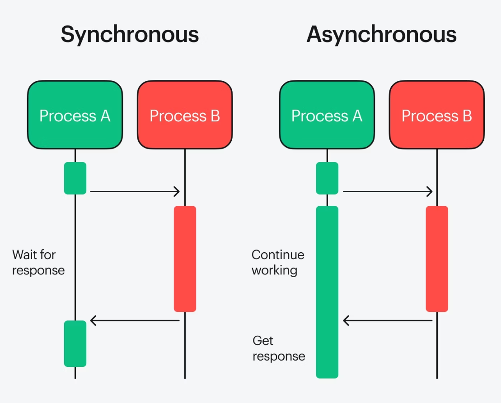
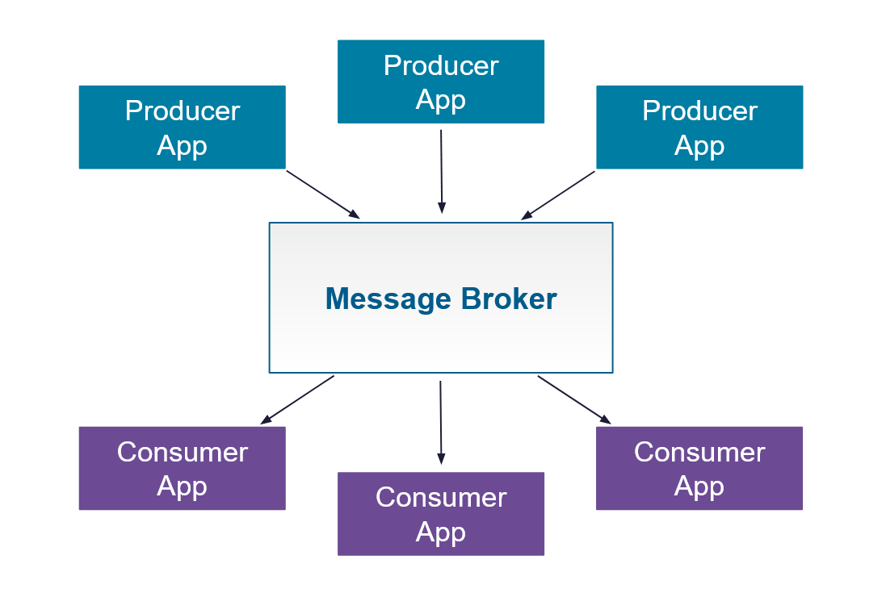
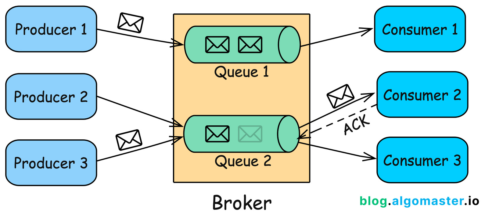
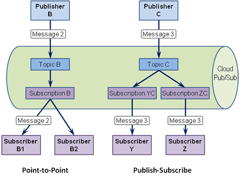

# Comunicação síncrona vs assíncrona

---

A comunicação entre componentes de um sistema pode acontecer de forma **síncrona** ou **assíncrona**.

A principal diferença está no comportamento de quem envia a mensagem enquanto o processamento acontece.



Essa escolha afeta aspectos como:

* Latência
* Acoplamento
* Disponibilidade
* Escalabilidade
* Tolerância a falhas
* Experiência do usuário
* Complexidade operacional

---

## Comunicação síncrona

Na comunicação síncrona, quem faz a chamada normalmente **aguarda uma resposta** antes de continuar o fluxo.

O modelo mais comum é request/response:

```text
Client
  |
  | Request
  v
Server
  |
  | Response
  v
Client
```

Exemplo:

```http
POST /orders
```

O cliente envia a requisição e aguarda:

```http
HTTP/1.1 201 Created
```

### Características

* O chamador fica aguardando uma resposta.
* Existe dependência temporal entre os componentes.
* Falhas ou lentidão do serviço chamado podem afetar o chamador.
* É simples de implementar e entender.

Um fluxo síncrono pode envolver vários serviços:

```text
Client
  |
  v
Service A
  |
  v
Service B
  |
  v
Service C
```

Nesse caso, uma requisição pode depender da disponibilidade de todos os serviços envolvidos.

---

## Request/Response

Request/response é o modelo tradicional de comunicação síncrona.

```text
Client
  |
  | Request
  v
Server
  |
  | processa
  |
  | Response
  v
Client
```

Exemplo:

```text
GET /products/123

        ↓

200 OK
{
  "id": 123,
  "name": "Produto"
}
```

Esse modelo é comum em:

* REST
* RPC
* gRPC
* GraphQL

### Quando utilizar

É adequado quando o resultado da operação é necessário para continuar o fluxo.

Por exemplo:

```text
Criar pedido
      |
      v
Obter ID do pedido
      |
      v
Retornar resposta ao cliente
```

O cliente precisa do resultado imediatamente, portanto uma comunicação síncrona faz sentido.

---

## Comunicação assíncrona

Na comunicação assíncrona, o produtor pode enviar uma mensagem sem precisar aguardar o processamento completo pelo consumidor.

```text
Producer
   |
   | Message
   v
Broker
   |
   | posteriormente
   v
Consumer
```

O produtor pode continuar sua execução enquanto o consumidor processa a mensagem.

```text
Producer
   |
   | envia
   v
Broker
   |
   +--------------------+
                        |
Producer continua       |
                        v
                     Consumer
```

### Características

* Menor acoplamento temporal.
* Permite processamento posterior.
* Pode absorver picos de carga.
* Permite desacoplar produtores e consumidores.
* Introduz maior complexidade operacional.

Um benefício importante é que o produtor não precisa necessariamente esperar o consumidor estar disponível.

```text
Service A
   |
   | evento
   v
Broker
   |
   | posteriormente
   v
Service B
```

Se o Service B estiver temporariamente indisponível, a mensagem pode permanecer armazenada no broker, dependendo da configuração.

---

## Fire-and-forget

Fire-and-forget é um padrão em que o produtor envia uma mensagem e **não espera o resultado do processamento**.

```text
Client
  |
  | mensagem
  v
Service
  |
  | retorna imediatamente
  v
Client
```

O processamento continua posteriormente:

```text
Client
  |
  | "enviar notificação"
  v
Service
  |
  | aceita solicitação
  v
Client

        ...

Service
  |
  v
Processamento
```

Um exemplo seria registrar uma atividade para processamento posterior:

```text
POST /audit-events
```

A aplicação pode aceitar a solicitação e colocar o evento em uma fila:

```text
API
 |
 | evento
 v
Queue
 |
 v
Worker
 |
 v
Database
```

O cliente não precisa esperar a gravação completa no banco para continuar.

### Cuidados

Fire-and-forget não significa que a mensagem será necessariamente processada com sucesso.

É necessário considerar:

* Persistência da mensagem
* Retry
* Dead-letter queue
* Idempotência
* Monitoramento
* Falhas do consumidor

---

## Callback

Callback é um mecanismo em que o resultado de uma operação é entregue posteriormente ao solicitante ou a outro endpoint.

Em vez de:

```text
Client
  |
  | request
  v
Server
  |
  | response
  v
Client
```

podemos ter:

```text
Client
  |
  | inicia operação
  v
Server
  |
  | processamento
  |
  | callback
  v
Client / Endpoint
```

Um exemplo comum é uma operação demorada:

```text
POST /reports
```

Resposta:

```json
{
  "jobId": "123",
  "status": "processing"
}
```

Quando o processamento termina, o sistema pode chamar:

```http
POST /callbacks/report
```

com o resultado:

```json
{
  "jobId": "123",
  "status": "completed",
  "file": "/reports/123.pdf"
}
```

### Callback vs polling

Sem callback, o cliente pode precisar consultar repetidamente:

```text
Client ---> GET /jobs/123
Client <--- processing

Client ---> GET /jobs/123
Client <--- processing

Client ---> GET /jobs/123
Client <--- completed
```

Com callback:

```text
Client ---> inicia operação

                 ...

Server ---> callback
```

O callback reduz consultas desnecessárias, mas exige que o sistema receptor disponibilize um endpoint acessível e preparado para receber notificações.

---

## Event-driven

Em uma arquitetura orientada a eventos, componentes comunicam mudanças de estado ou acontecimentos através de **eventos**.

Um evento representa algo que aconteceu:

```text
OrderCreated
PaymentApproved
UserRegistered
InvoiceGenerated
```

Exemplo:

```text
Order Service
     |
     | OrderCreated
     v
 Event Broker
     |
     +-----------> Payment Service
     |
     +-----------> Notification Service
     |
     +-----------> Analytics Service
```

O produtor não precisa conhecer diretamente todos os consumidores.

### Command vs Event

É importante diferenciar comando e evento.

**Command:**

```text
ProcessPayment
```

Representa uma solicitação:

> Faça alguma coisa.

**Event:**

```text
PaymentProcessed
```

Representa algo que já aconteceu:

> Alguma coisa aconteceu.

Conceitualmente:

```text
Command
   |
   v
"Faça X"

Event
   |
   v
"X aconteceu"
```

Essa diferença ajuda a reduzir o acoplamento entre componentes.

---

## Message Broker

Um message broker é um componente intermediário responsável por receber, armazenar e entregar mensagens entre produtores e consumidores.



Exemplos de tecnologias:

* RabbitMQ
* Apache Kafka
* Amazon SQS
* Apache Pulsar

O broker pode fornecer funcionalidades como:

* Filas
* Tópicos
* Persistência
* Retry
* Ordenação
* Consumer groups
* Dead-letter queues
* Controle de entrega

---

## Queue

Uma fila normalmente distribui mensagens entre consumidores.



Dependendo da configuração, uma mensagem pode ser processada por apenas um consumidor de um grupo.

Isso permite distribuir trabalho:

```text
Queue
 |
 +--> Worker 1
 |
 +--> Worker 2
 |
 +--> Worker 3
```

Se existirem muitas mensagens:

```text
Queue
 |
 | mensagem
 | mensagem
 | mensagem
 | mensagem
 v
Workers
```

novos consumidores podem ser adicionados para aumentar a capacidade de processamento, respeitando as limitações do sistema.

---

## Pub/Sub

O Pub/Sub (Publisher/Subscriber) é um padrão arquitetural de mensageria assíncrona que desacopla quem envia as mensagens (publicadores) de quem as consome (assinantes).

- **Publicadores (Publishers)**: Enviam mensagens para um canal ou tópico específico sem precisar saber quem vai recebê-las.
- **Tópicos (Topics)**: O ponto de encontro onde as mensagens são categorizadas e armazenadas temporariamente.
- **Assinantes (Subscribers)**: Se inscrevem nos tópicos de interesse para receber e processar as mensagens de forma independente



Cada consumidor pode processar o mesmo evento de maneira independente.

Isso é especialmente útil quando vários componentes precisam reagir ao mesmo acontecimento.

---

## Síncrono vs assíncrono

| Característica          | Síncrono               | Assíncrono                       |
| ----------------------- | ---------------------- | -------------------------------- |
| Aguarda resposta        | Sim                    | Normalmente não                  |
| Acoplamento temporal    | Maior                  | Menor                            |
| Complexidade            | Menor                  | Maior                            |
| Processamento posterior | Não é o foco           | Sim                              |
| Absorção de picos       | Limitada               | Pode ser maior                   |
| Falhas temporárias      | Podem bloquear o fluxo | Podem ser absorvidas pelo broker |
| Consistência imediata   | Mais comum             | Pode ser eventual                |
| Observabilidade         | Mais simples           | Mais complexa                    |

---

## Exemplo prático

Imagine um sistema de pedidos.

### Fluxo totalmente síncrono

```text
Client
  |
  v
Order Service
  |
  v
Payment Service
  |
  v
Inventory Service
  |
  v
Notification Service
  |
  v
Response
```

O tempo total depende dos serviços envolvidos:

```text
Tempo total = Order + Payment + Inventory + Notification
```

Uma falha em qualquer etapa pode afetar a requisição original.

### Fluxo combinado

Uma arquitetura pode separar operações que precisam de resposta imediata das que podem acontecer posteriormente:

```text
Client
  |
  v
Order Service
  |
  +----> Payment Service
  |           |
  |           v
  |        Response
  |
  +----> Event Broker
             |
             +--> Notification
             |
             +--> Analytics
             |
             +--> Loyalty
```

O pagamento pode ser necessário para determinar o resultado do pedido, enquanto notificações e analytics podem ser processados posteriormente.

Esse tipo de combinação é bastante comum em sistemas distribuídos.

---

## Backpressure

Quando produtores geram mensagens mais rapidamente do que consumidores conseguem processá-las, a quantidade de mensagens pendentes pode crescer.

```text
Producer
   |
   | 1000 msg/s
   v
 Queue
   |
   | 500 msg/s
   v
Consumer
```

A fila cresce:

```text
1000 msg/s entrando
500 msg/s processadas

→ backlog aumentando
```

Esse fenômeno é chamado de **backpressure** ou está relacionado ao gerenciamento de pressão do sistema.

Algumas estratégias incluem:

* Aumentar consumidores
* Limitar produtores
* Processar em batches
* Aplicar rate limiting
* Ajustar capacidade do broker
* Descartar ou priorizar determinados eventos

Backpressure é importante porque uma arquitetura assíncrona não elimina problemas de capacidade; ela pode apenas deslocar o problema para uma fila.

---

## Trade-offs

Comunicação assíncrona não é automaticamente melhor que comunicação síncrona.

Ela pode melhorar:

* Desacoplamento
* Escalabilidade
* Resiliência a indisponibilidades temporárias
* Processamento de tarefas demoradas

Mas também adiciona:

* Brokers
* Filas
* Retry
* Dead-letter queues
* Idempotência
* Monitoramento
* Eventual consistency
* Maior dificuldade de rastreamento

A decisão deve considerar o comportamento necessário para cada operação.

```text
Precisa do resultado imediatamente?
        |
        +-- Sim → Síncrono

Pode processar posteriormente?
        |
        +-- Sim → Assíncrono

Vários serviços precisam reagir ao mesmo evento?
        |
        +-- Sim → Event-driven / Pub-Sub

Precisa distribuir trabalho entre workers?
        |
        +-- Sim → Queue

Precisa receber o resultado posteriormente?
        |
        +-- Sim → Callback
```

Uma arquitetura real pode combinar todos esses modelos.

---

<div style="display: flex; justify-content: space-between;">

[← APIs](./2.4-apis.md)

[Conceitos importantes →](./2.6-important-concepts.md)

</div>
