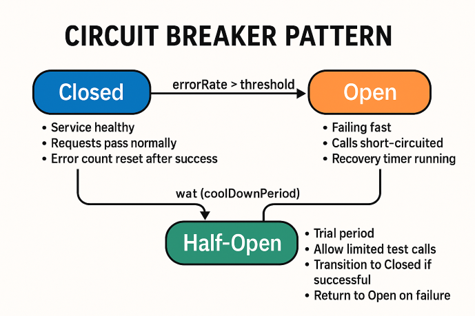
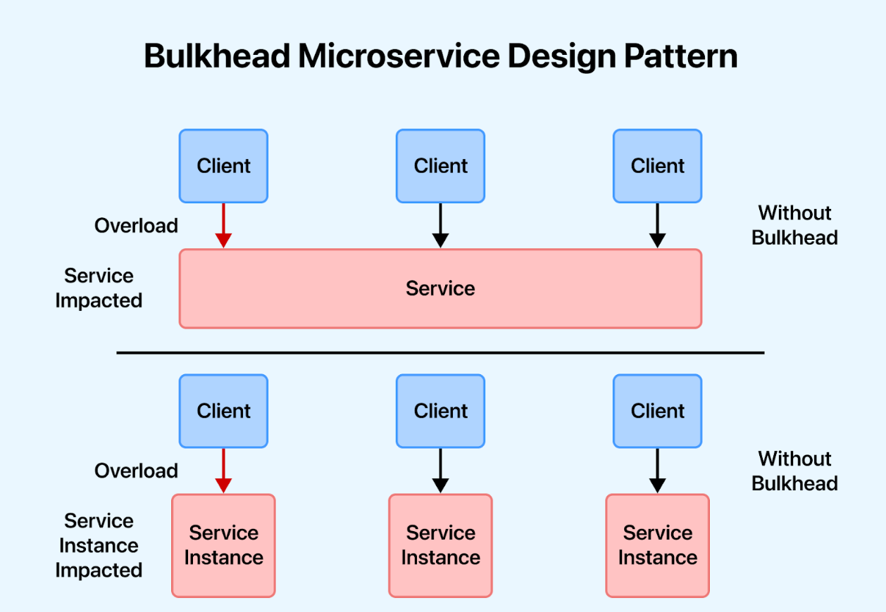

# Conceitos importantes

---

Sistemas distribuídos dependem de comunicação entre diferentes componentes.

Essa comunicação pode falhar por diversos motivos:

* Serviço indisponível
* Rede instável
* Alta latência
* Sobrecarga
* Perda de pacotes
* Conexões esgotadas
* Falhas temporárias

Alguns mecanismos são utilizados para tornar o sistema mais resiliente:

* Timeout
* Retry
* Backoff
* Exponential backoff
* Jitter
* Connection pool
* Circuit breaker
* Rate limiting
* Bulkhead

Esses mecanismos possuem objetivos diferentes e normalmente são combinados.

---

## Timeout

Timeout define quanto tempo uma operação pode permanecer aguardando antes de ser considerada uma falha.

Sem timeout:

```text
Client
  |
  | request
  v
Server
  |
  | sem resposta
  |
  |
  |
  v
Client aguardando indefinidamente
```

Com timeout:

```text
Client
  |
  | request
  v
Server
  |
  | sem resposta
  |
  X timeout
  |
  v
Client
```

Existem diferentes tipos de timeout, dependendo da tecnologia:

* Connection timeout
* Read timeout
* Write timeout
* Request timeout

### Connection timeout

Define quanto tempo aguardar para estabelecer uma conexão.

```text
Client ---- connection ----> Server
              |
              | demora
              X
```

### Read timeout

Define quanto tempo aguardar por dados após a conexão ter sido estabelecida.

```text
Client ---- request ----> Server

Client <---- resposta ----
              |
              | demora
              X timeout
```

### Por que timeout é importante?

Sem timeout, uma quantidade pequena de requisições lentas pode consumir recursos durante muito tempo.

```text
100 requisições
     |
     v
100 conexões ocupadas
     |
     v
novas requisições
     |
     v
sem recursos disponíveis
```

Timeouts ajudam a impedir que uma falha em um componente se propague indefinidamente.

---

## Retry

Retry significa tentar novamente uma operação que falhou.

Exemplo:

```text
Client
  |
  | request
  v
Server
  |
  X erro
  |
Client
  |
  | retry
  v
Server
  |
  | sucesso
  v
Client
```

Retries podem ser úteis para **falhas temporárias**, como:

* Timeout
* Erro de conexão
* Indisponibilidade temporária
* Falhas transitórias de infraestrutura

Porém, nem todo erro deve gerar retry.

Por exemplo:

```text
400 Bad Request
401 Unauthorized
403 Forbidden
404 Not Found
```

normalmente não são corrigidos simplesmente repetindo a mesma requisição.

### Idempotência

Retry exige atenção especial quando a operação possui efeitos colaterais.

Imagine:

```text
POST /payments
```

A primeira requisição pode ter sido processada pelo servidor, mas a resposta pode ter sido perdida:

```text
Client
  |
  | pagamento
  v
Server
  |
  | pagamento processado
  |
  X resposta perdida
  |
Client
```

O cliente não sabe se a operação foi executada.

Se fizer retry:

```text
Client
  |
  | pagamento novamente
  v
Server
```

pode ocorrer duplicidade.

Por isso, operações que podem sofrer retry frequentemente precisam de mecanismos de **idempotência**.

---

## Backoff

Backoff define um intervalo de espera antes de realizar um retry.

Sem backoff:

```text
Falha
 |
 +--> retry imediato
 |
 +--> retry imediato
 |
 +--> retry imediato
```

Com backoff:

```text
Falha
 |
 | espera
 v
Retry
 |
 | espera
 v
Retry
 |
 | espera
 v
Retry
```

O objetivo é evitar que um serviço sobrecarregado receba imediatamente ainda mais requisições.

---

## Exponential backoff

No exponential backoff, o intervalo de espera aumenta a cada tentativa.

Por exemplo:

```text
Tentativa 1 → 100 ms
Tentativa 2 → 200 ms
Tentativa 3 → 400 ms
Tentativa 4 → 800 ms
Tentativa 5 → 1600 ms
```

Uma fórmula simplificada:

```text
delay = base × 2^attempt
```

Na prática, normalmente existe também um limite:

```text
delay = min(base × 2^attempt, maxDelay)
```

Exemplo:

```text
base = 100 ms
maxDelay = 5 s

100 ms
200 ms
400 ms
800 ms
1600 ms
3200 ms
5000 ms
5000 ms
```

Isso reduz a pressão sobre um serviço que está apresentando falhas.

---

## Jitter

Se muitos clientes falharem ao mesmo tempo e utilizarem exatamente o mesmo exponential backoff, eles podem realizar os retries simultaneamente.

```text
Serviço fica indisponível
        |
        +---- Client A → retry em 1s
        +---- Client B → retry em 1s
        +---- Client C → retry em 1s
        +---- Client D → retry em 1s
        |
        v
Muitas requisições simultâneas
```

Esse comportamento pode gerar um **thundering herd** (estouro de manada), um grande número de processos, threads ou requisições são despertados ou disparados simultaneamente para acessar um único recurso..

Jitter adiciona uma variação aleatória ao intervalo.

```text
Client A → retry em 0.8s
Client B → retry em 1.2s
Client C → retry em 0.9s
Client D → retry em 1.4s
```

Assim, as requisições ficam distribuídas no tempo.

Uma forma simplificada:

```text
delay = exponentialBackoff + randomValue
```

Jitter é especialmente útil quando muitos clientes utilizam a mesma política de retry.

---

## Connection Pool

Connection pool é um conjunto de conexões reutilizáveis mantidas pela aplicação.

Sem pool:

```text
Request
  |
  +--> abre conexão
  |
  +--> utiliza
  |
  +--> fecha conexão
```

Repetidamente:

```text
Request 1 → abre → usa → fecha
Request 2 → abre → usa → fecha
Request 3 → abre → usa → fecha
```

Com connection pool:

```text
              +----------------+
              | Connection Pool|
              +----------------+
                |   |   |   |
                v   v   v   v
              Conn Conn Conn Conn
```

As conexões podem ser reutilizadas:

```text
Request 1 → pega conexão → usa → devolve
Request 2 → pega conexão → usa → devolve
Request 3 → pega conexão → usa → devolve
```

### Exemplo com banco

Uma aplicação Spring Boot normalmente utiliza um pool de conexões JDBC, como o HikariCP.

```text
Spring Boot
     |
     v
Connection Pool
     |
     +--> DB connection
     +--> DB connection
     +--> DB connection
     +--> DB connection
     |
     v
Database
```

O pool normalmente possui parâmetros como:

* Tamanho máximo
* Tamanho mínimo
* Timeout para obter conexão
* Tempo máximo de vida
* Tempo de idle

### Problema de pool esgotado

Se todas as conexões estiverem ocupadas:

```text
Pool
 |
 +--> Conn 1 ocupada
 +--> Conn 2 ocupada
 +--> Conn 3 ocupada
 +--> Conn 4 ocupada
 |
 v
Nova requisição
 |
 v
aguarda conexão
 |
 v
timeout
```

Portanto, aumentar o tamanho do pool nem sempre resolve o problema.

Se o banco suporta poucas conexões, aumentar indiscriminadamente o pool pode apenas transferir a sobrecarga para o banco.

---

## Circuit Breaker

Circuit breaker impede que uma aplicação continue enviando requisições para um serviço que está apresentando falhas.

O comportamento é inspirado em um disjuntor elétrico.

Existem três estados principais:



### Closed

Operação normal:

```text
Client
  |
  v
Circuit Breaker
  |
  v
Service
```

As requisições são encaminhadas normalmente.

### Open

Depois de atingir determinado limite de falhas:

```text
Client
  |
  v
Circuit Breaker
  |
  X
Service
```

As chamadas são bloqueadas imediatamente.

Isso evita continuar sobrecarregando o serviço que está falhando.

### Half-open

Depois de algum tempo, o circuit breaker permite algumas requisições de teste:

```text
Client
  |
  v
Circuit Breaker
  |
  | teste
  v
Service
```

Se o serviço estiver funcionando novamente:

```text
HALF_OPEN
    |
    | sucesso
    v
 CLOSED
```

Se continuar falhando:

```text
HALF_OPEN
    |
    | falha
    v
 OPEN
```

### Circuit breaker vs retry

Eles possuem objetivos diferentes.

**Retry:**

```text
Falha
 |
 +--> tenta novamente
```

**Circuit breaker:**

```text
Muitas falhas
 |
 +--> para temporariamente de chamar
```

Eles podem ser combinados:

```text
Request
   |
   v
Circuit Breaker
   |
   v
Retry
   |
   v
Service
```

A configuração deve evitar que retries excessivos impeçam o circuit breaker de atuar.

---

## Rate Limiting

Rate limiting limita a quantidade de requisições que podem ser processadas em determinado período.

Exemplo:

```text
100 requests / segundo
```

Se o limite for excedido:

```text
Client
  |
  | 101ª request
  v
Rate Limiter
  |
  X
429 Too Many Requests
```

O rate limiting pode proteger:

* APIs
* Bancos
* Serviços internos
* Recursos computacionais
* Serviços de terceiros

### Exemplo

```text
API
 |
 v
Rate Limiter
 |
 +---- permitido ---> Backend
 |
 +---- excedido ----> 429
```

Existem diferentes algoritmos para implementar rate limiting, como:

#### 1. Fixed Window
```text
Divide o tempo em blocos fixos (por exemplo, 1 minuto) e zera um contador a cada nova janela.

Vantagem: Muito simples de implementar e consome pouca memória.

Desvantagem: Permite picos de tráfego nas bordas (o usuário pode estourar o limite no fim de um minuto e logo no início do seguinte).
```

#### 2. Sliding Window 

```text
Calcula o limite considerando uma faixa de tempo móvel (por exemplo, os últimos 60 segundos contados a partir do momento atual) em vez de reiniciar em horários fixos.

Vantagem: Resolve o problema de picos nas bordas e distribui o limite de forma justa e precisa.

Desvantagem: É mais complexo de programar e exige maior uso de memória ou processamento para rastrear os registros de tempo.
```

#### 3. Token Bucket 

```text
Existe um balde com capacidade máxima que recebe tokens (fichas) a uma taxa constante. Cada requisição consome um token; se o balde estiver vazio, a requisição é negada.

Vantagem: Permite picos curtos de tráfego se houver tokens acumulados durante períodos ociosos, mantendo a média a longo prazo.

Desvantagem: Requer lógica contínua de recarga e rastreio de tokens.
```

#### 4. Leaky Bucket

```text
As requisições entram em uma fila (FIFO — primeiro a entrar, primeiro a sair) e são processadas (vazadas) por um ritmo estavel e constante. Se chegarem mais requisições do que a capacidade da fila, o excedente é descartado.

Vantagem: Suaviza completamente o tráfego, garantindo uma saída em velocidade constante e previsível para o servidor.

Desvantagem: Não lida bem com picos legítimos e pode atrasar ou descartar requisições se houver congestionamento repentino.
```

### Rate limiting distribuído

Em múltiplas instâncias:

```text
             Load Balancer
                  |
        +---------+---------+
        |         |         |
        v         v         v
      API 1     API 2     API 3
```

Um limite armazenado apenas na memória de cada instância pode não representar o limite global.

Por isso, pode ser necessário utilizar um mecanismo compartilhado, como Redis.

```text
API 1 ----+
API 2 ----+----> Redis
API 3 ----+
```

---

## Bulkhead

Bulkhead é uma estratégia para impedir que uma falha ou sobrecarga em uma parte do sistema consuma todos os recursos disponíveis.

O nome vem das divisórias utilizadas em navios.

A ideia é separar recursos:

```text
                 Application
                     |
          +----------+----------+
          |                     |
      Pool A                  Pool B
          |                     |
     Service A              Service B
```

Se o Service A apresentar problemas:

```text
Service A
   |
   v
Pool A
   |
   X saturado

Pool B
   |
   v
Service B
   |
   v
continua funcionando
```

Sem isolamento:

```text
                 Application
                      |
                Pool único
                      |
          +-----------+-----------+
          |           |           |
       Service A  Service B   Service C
```

Se o Service A consumir todos os recursos:

```text
Service A
    |
    v
Pool saturado
    |
    +--> Service B afetado
    +--> Service C afetado
```



Bulkhead pode ser aplicado a diferentes recursos:

* Threads
* Connection pools
* HTTP client pools
* Filas
* Workers
* Permits/semafóros

---

## Como os conceitos se relacionam

Esses mecanismos normalmente trabalham em conjunto.

Um fluxo de comunicação entre serviços pode ser:

```text id="e9x9d7"
Client
  |
  v
Rate Limiter
  |
  v
Circuit Breaker
  |
  v
Retry + Backoff + Jitter
  |
  v
Connection Pool
  |
  v
Service
```

Cada mecanismo resolve um problema diferente:

```text
Timeout
  → Quanto tempo esperar?

Retry
  → Tentar novamente?

Backoff
  → Quanto esperar antes do retry?

Exponential Backoff
  → Aumentar progressivamente o intervalo?

Jitter
  → Evitar retries simultâneos?

Connection Pool
  → Como reutilizar conexões?

Circuit Breaker
  → Quando parar de chamar um serviço?

Rate Limiting
  → Quantas requisições permitir?

Bulkhead
  → Como impedir que uma parte consuma todos os recursos?
```

---

## Exemplo completo

Imagine:

```text
Order Service
      |
      v
Payment Service
```

Uma configuração de resiliência poderia ser:

```text
Order Service
      |
      v
Rate Limiter
      |
      v
Circuit Breaker
      |
      v
Retry
      |
      +-- 100ms
      +-- 200ms
      +-- 400ms
      |
      v
HTTP Connection Pool
      |
      v
Payment Service
```

Com:

```text
Timeout = 2s
Retry = 3 tentativas
Backoff = exponencial
Jitter = habilitado
Circuit Breaker = abre após determinado número de falhas
Rate Limit = limite definido por capacidade
Connection Pool = tamanho limitado
```

Esses valores não são universais. Devem ser definidos de acordo com:

* Latência esperada
* Capacidade do serviço
* Volume de tráfego
* SLA
* Tipo de operação
* Custo da operação
* Comportamento em caso de falha

---

Esses conceitos são fundamentais para projetar sistemas distribuídos capazes de lidar com **latência, falhas temporárias, sobrecarga e indisponibilidade parcial**.

---

<div style="display: flex; justify-content: space-between;">

[← Comunicação síncrona vs assíncrona](./2.5-synchronous-vs-asynchronous.md)

[Real-time e protocolos especializados →](./2.7-real-time-communication-and-specialized-protocols.md)

</div>
