# Comunicação em tempo real e protocolos especializados

---

Nem todo sistema pode utilizar apenas HTTP/REST para comunicação.

Alguns cenários possuem requisitos específicos, como:

* Comunicação bidirecional em tempo real
* Áudio e vídeo
* Streaming de mídia
* Baixa latência
* Comunicação entre dispositivos IoT
* Transporte de alta performance
* Mensageria entre sistemas

Para esses casos existem protocolos e tecnologias especializados.

---

## Peer-to-Peer (P2P)

Peer-to-Peer (P2P) é um modelo de comunicação em que os participantes da rede podem se comunicar diretamente entre si, sem depender necessariamente de um servidor central para intermediar toda a comunicação.

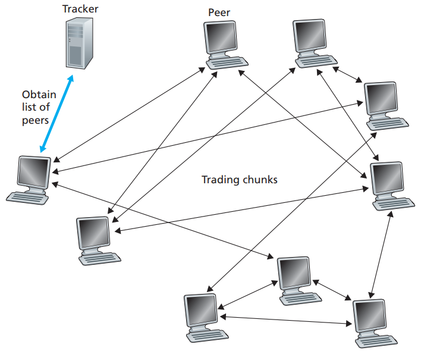

No modelo cliente-servidor, o servidor normalmente concentra o processamento ou a comunicação.

No P2P, os próprios participantes podem trocar dados diretamente.

---

## Comunicação direta

Uma das principais vantagens do P2P é reduzir a necessidade de passar todos os dados por um servidor central.

Por exemplo, em uma comunicação de vídeo:

```text
Modelo centralizado:

Client A
   |
   | vídeo
   v
Server
   |
   | vídeo
   v
Client B
```

Em P2P:

```text
Client A
   |
   | vídeo
   v
Client B
```

Isso pode reduzir o tráfego necessário no servidor.

Porém, uma conexão P2P direta nem sempre é possível devido a NATs, firewalls e restrições de rede.

Por isso, tecnologias como **STUN, TURN e ICE** são importantes em cenários como WebRTC.

---

## P2P não significa ausência de servidores

Uma arquitetura P2P ainda pode utilizar servidores para funções auxiliares.

Por exemplo:

```text
              Signaling Server
                 /        \
                /          \
               v            v
          Client A <------> Client B
                    P2P
```

O servidor pode ser responsável por:

* Descoberta dos peers
* Autenticação
* Sinalização
* Coordenação da conexão
* Distribuição de metadados

Depois que a conexão é estabelecida, os dados podem ser transmitidos diretamente entre os peers.

---

## Exemplos

P2P pode ser utilizado em diferentes cenários:

* WebRTC
* Compartilhamento de arquivos
* BitTorrent
* Comunicação entre dispositivos
* Jogos multiplayer
* Redes distribuídas

No BitTorrent, por exemplo, um arquivo pode ser distribuído entre vários peers:

```text id="v6n2pk"
             Tracker / DHT
                  |
       +----------+----------+
       |          |          |
       v          v          v
     Peer A     Peer B     Peer C
       ^          ^          ^
        \         |         /
         \        |        /
          +-------+-------+
```

Os peers podem compartilhar diferentes partes do conteúdo entre si.

---

## Vantagens

* Redução da dependência de um servidor central
* Possibilidade de reduzir custos de infraestrutura
* Distribuição da carga entre os participantes
* Comunicação direta
* Pode oferecer baixa latência em determinados cenários

## Desafios

* Peers podem entrar e sair da rede
* NAT e firewalls podem impedir conexões diretas
* Segurança e autenticação são mais complexas
* Descoberta de peers pode ser necessária
* Disponibilidade dos dados pode depender dos participantes
* Monitoramento e controle são mais difíceis

---

## P2P vs Cliente-Servidor

| Característica          | Cliente-Servidor          | P2P                               |
| ----------------------- | ------------------------- | --------------------------------- |
| Comunicação             | Via servidor              | Pode ser direta                   |
| Dependência de servidor | Alta                      | Menor                             |
| Controle central        | Maior                     | Menor                             |
| Distribuição de carga   | Servidores                | Peers                             |
| Complexidade            | Menor                     | Maior                             |
| NAT/Firewall            | Normalmente mais simples  | Pode ser um desafio               |
| Escalabilidade          | Depende da infraestrutura | Pode distribuir carga entre peers |

P2P é, portanto, um **modelo arquitetural de comunicação**, e não um protocolo específico.

Tecnologias como **WebRTC** podem utilizar P2P, enquanto mecanismos como **STUN, TURN e ICE** ajudam a tornar esse modelo viável em redes reais.

---

## WebRTC

WebRTC (Web Real-Time Communication) permite comunicação de áudio, vídeo e dados em tempo real entre dispositivos.

Um dos principais usos é comunicação diretamente entre navegadores ou aplicações:

```text id="r8m2k1"
Client A <=================> Client B
          áudio/vídeo/dados
```

O WebRTC pode utilizar comunicação **peer-to-peer (P2P)**, reduzindo a necessidade de transportar toda a mídia através de um servidor central.

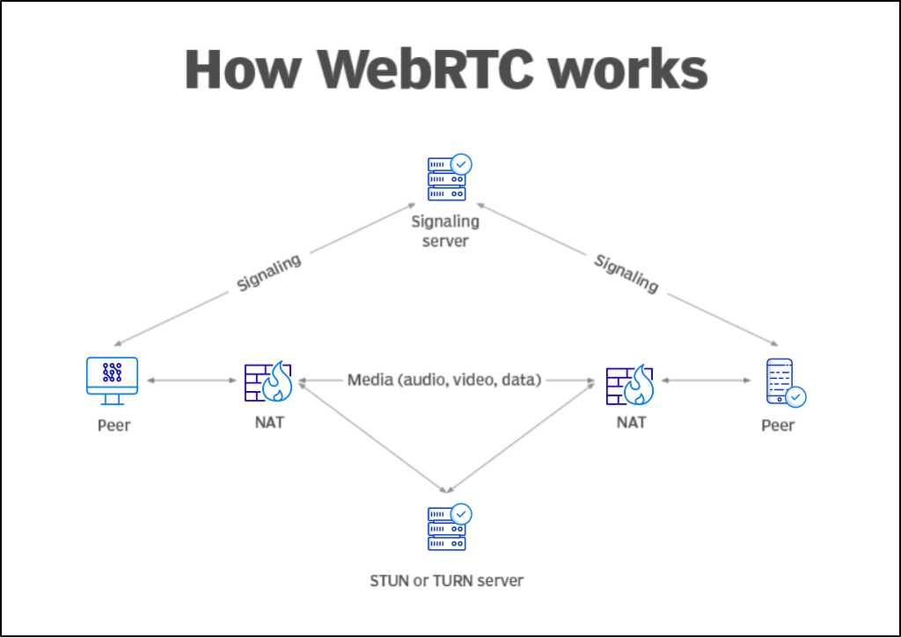

Exemplos:

* Videochamadas
* Conferências
* Compartilhamento de tela
* Jogos multiplayer
* Comunicação de voz
* Transferência de dados em tempo real

Uma arquitetura típica envolve um servidor de sinalização.

O servidor de sinalização ajuda os clientes a descobrir como estabelecer a conexão, mas não necessariamente transporta o áudio e vídeo.

---

## ICE

ICE (Interactive Connectivity Establishment) é um mecanismo utilizado pelo WebRTC para encontrar um caminho possível entre dois dispositivos.

O problema é que os clientes podem estar atrás de:

* NAT
* Firewall
* Roteadores
* Redes corporativas

O ICE tenta encontrar uma rota viável utilizando diferentes candidatos de conexão.

```text id="p8m4sz"
Client A
   |
   +-- caminho direto
   |
   +-- STUN
   |
   +-- TURN
   |
   v
Client B
```

ICE normalmente trabalha em conjunto com **STUN** e **TURN**.

---

## STUN

STUN (Session Traversal Utilities for NAT) permite que um dispositivo descubra como ele é visto externamente através de um NAT.

Exemplo:

```text id="m2x6qc"
Client
10.0.0.10:5000
   |
   v
 NAT
   |
   v
203.0.113.10:62000
   |
   v
Internet
```

O servidor STUN informa ao cliente o endereço público observado.

```text id="6m1v8x"
Client
  |
  | "Qual é meu endereço externo?"
  v
STUN Server
  |
  | "Você aparece como
  | 203.0.113.10:62000"
  v
Client
```

STUN ajuda a estabelecer conexões diretas, mas **não garante** que uma conexão P2P será possível em todas as redes.

---

## TURN

TURN (Traversal Using Relays around NAT) é utilizado quando uma conexão direta não é possível.

Nesse caso, um servidor atua como relay:

```text id="j8p3qd"
Client A
   |
   v
TURN Server
   |
   v
Client B
```

A mídia passa pelo servidor TURN:

```text id="h4m7sx"
Client A
   |
   | áudio/vídeo
   v
TURN
   |
   | áudio/vídeo
   v
Client B
```

Isso aumenta o custo de infraestrutura porque o servidor precisa transportar o tráfego de mídia.

Por outro lado, TURN aumenta a capacidade de estabelecer comunicação em redes onde conexões diretas não funcionam.

---

## STUN vs TURN

| Tecnologia | Função                                               |
| ---------- | ---------------------------------------------------- |
| STUN       | Descobrir endereço externo e auxiliar conexão direta |
| TURN       | Encaminhar o tráfego através de um relay             |
| ICE        | Coordenar e selecionar os caminhos disponíveis       |

O relacionamento pode ser representado assim:

```text id="x2z5jq"
                 ICE
                  |
          +-------+-------+
          |               |
        STUN            TURN
          |               |
    conexão direta    relay
```

---

## RTP

RTP (Real-time Transport Protocol) é utilizado para transportar dados de mídia em tempo real, como:

* Áudio
* Vídeo

O RTP adiciona informações importantes aos pacotes, como:

* Número de sequência
* Timestamp
* Identificação da fonte

Isso permite ao receptor reconstruir o fluxo de mídia.

```text id="m7n3wc"
Áudio/Vídeo
     |
     v
    RTP
     |
     v
Rede
     |
     v
  Receiver
```

RTP normalmente é utilizado sobre UDP.

```text id="z6v4pk"
RTP
 |
 v
UDP
 |
 v
IP
```

O uso de UDP permite evitar o comportamento de retransmissão e controle de congestionamento do TCP quando isso seria prejudicial para aplicações de tempo real.

Em uma chamada de vídeo, por exemplo, um pequeno atraso pode ser mais prejudicial do que perder alguns pacotes.

---

## RTCP

RTCP (RTP Control Protocol) acompanha o RTP e fornece informações de controle e monitoramento da sessão.

Pode fornecer informações como:

* Perda de pacotes
* Jitter
* Qualidade da transmissão
* Sincronização entre áudio e vídeo

Conceitualmente:

```text id="h2c7vz"
        RTP
         |
         | mídia
         v
      Receiver

        RTCP
         |
         | informações de controle
         v
      Receiver
```

RTP transporta a mídia.

RTCP fornece informações sobre a transmissão.

---

## SRTP

SRTP (Secure Real-time Transport Protocol) é uma extensão do RTP que adiciona segurança.

Ele fornece proteção para:

* Confidencialidade
* Integridade
* Autenticação

```text id="x7f2km"
RTP
 |
 +-- segurança
 |
 v
SRTP
```

Em uma comunicação de áudio ou vídeo:

```text id="p5j9qr"
Microfone
   |
   v
SRTP
   |
   v
Internet
   |
   v
SRTP
   |
   v
Speaker
```

O SRTP é utilizado em tecnologias de comunicação em tempo real, incluindo WebRTC.

---

## SIP

SIP (Session Initiation Protocol) é um protocolo utilizado para **iniciar, modificar e encerrar sessões de comunicação**.

É comum em sistemas de telefonia IP e VoIP.

SIP não é responsável por transportar diretamente o áudio ou vídeo.

Uma arquitetura pode ser:

```text id="k9m4tx"
SIP
 |
 | estabelece sessão
 v
RTP / SRTP
 |
 | transporta mídia
 v
Áudio / Vídeo
```

Exemplo:

```text id="z3p8cv"
Telefone A
    |
    | SIP
    v
Servidor VoIP
    |
    | SIP
    v
Telefone B

Telefone A <==========> Telefone B
             RTP
```

SIP é utilizado para operações como:

* Iniciar chamada
* Encerrar chamada
* Registrar dispositivos
* Negociar informações da sessão

---

# Streaming

Streaming permite transmitir conteúdo continuamente sem exigir que o cliente tenha todo o conteúdo disponível antes de começar a reprodução.

```text id="q6k3rp"
Server
   |
   | segmento
   v
Client
   |
   | reproduz
   |
   | próximo segmento
   v
Client
```

Existem diferentes tecnologias de streaming dependendo do tipo de conteúdo e dos requisitos de distribuição.

---

## RTMP

RTMP (Real-Time Messaging Protocol) é um protocolo historicamente utilizado para transmissão de áudio, vídeo e dados em tempo real.

Um uso comum é enviar conteúdo de um encoder para uma plataforma de streaming:

```text id="u3x7mc"
Camera
   |
   v
Encoder
   |
   | RTMP
   v
Streaming Server
```

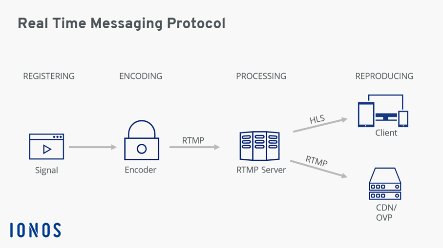

RTMP é bastante associado à etapa de **ingestão** de vídeo.

Por exemplo:

```text id="c8w2nz"
OBS
 |
 | RTMP
 v
Streaming Platform
```

Hoje, outras tecnologias são frequentemente utilizadas para a distribuição do vídeo aos espectadores.

---

## RTSP

RTSP (Real Time Streaming Protocol) é utilizado para controlar sessões de streaming, sendo comum em cenários como câmeras IP e sistemas de vigilância.

```text id="a4m7vx"
IP Camera
    |
    | RTSP
    v
Media Server
```

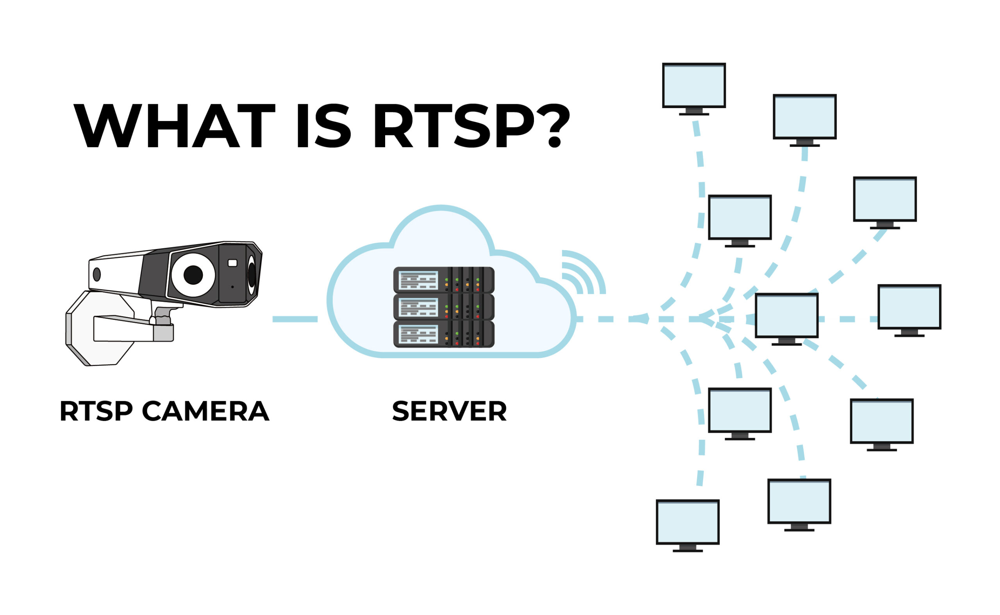

RTSP fornece operações relacionadas ao controle da sessão, como:

* Play
* Pause
* Teardown

O transporte efetivo da mídia pode utilizar outros protocolos, como RTP.

Uma arquitetura pode ser:

```text id="f2n8qz"
RTSP
  |
  | controle
  v
Media Server
  |
  | RTP
  v
Client
```

---

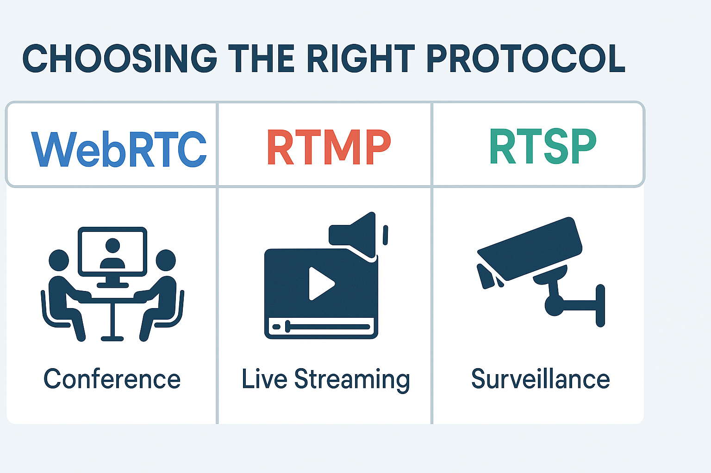

---

## HLS

HLS (HTTP Live Streaming) é uma tecnologia de streaming desenvolvida pela Apple.

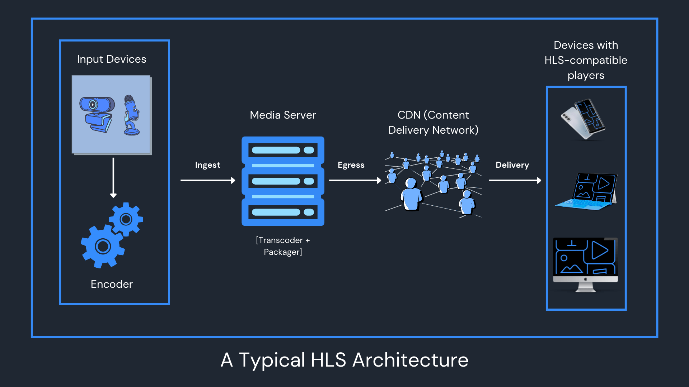

O conteúdo é dividido em pequenos segmentos e disponibilizado através de HTTP.

```text id="v8m3ps"
Video
  |
  v
Encoder
  |
  v
Segments
  |
  +--> segment-001
  +--> segment-002
  +--> segment-003
  +--> segment-004
```

O cliente baixa os segmentos progressivamente:

```text id="n4c6yt"
Client
  |
  +--> segment-001
  |
  +--> segment-002
  |
  +--> segment-003
  |
  +--> segment-004
```

Uma das principais vantagens é utilizar infraestrutura HTTP existente:

```text id="q5r9wx"
Client
   |
   v
CDN
   |
   v
HLS segments
```

Isso facilita distribuição em grande escala e integração com CDNs.

HLS também pode utilizar diferentes qualidades de vídeo:

```text id="z7k2mv"
1080p
720p
480p
360p
```

O cliente pode escolher ou adaptar a qualidade de acordo com a largura de banda disponível.

---

## MPEG-DASH

MPEG-DASH (Dynamic Adaptive Streaming over HTTP) possui uma abordagem semelhante ao HLS.

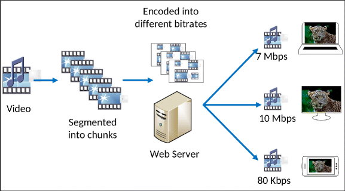

O vídeo é dividido em segmentos e disponibilizado através de HTTP.

```text id="p3x8kc"
Video
  |
  v
Segments
  |
  +--> 1080p
  +--> 720p
  +--> 480p
  +--> 360p
```

O cliente pode adaptar a qualidade durante a reprodução:

```text id="w5n7qr"
Boa conexão
     |
     v
  1080p

Conexão piora
     |
     v
   720p

Conexão melhora
     |
     v
  1080p
```

Isso é chamado de **Adaptive Bitrate Streaming (ABR)**.

### HLS vs MPEG-DASH

| Característica   | HLS             | MPEG-DASH       |
| ---------------- | --------------- | --------------- |
| Transporte       | HTTP            | HTTP            |
| Segmentação      | Sim             | Sim             |
| Adaptive bitrate | Sim             | Sim             |
| CDN              | Excelente       | Excelente       |
| Padrão           | Apple           | MPEG            |
| Uso              | Muito difundido | Muito difundido |

Para um sistema de streaming em larga escala, HLS e MPEG-DASH podem ser interessantes porque aproveitam HTTP e infraestrutura de CDN.

---

# Transporte

## QUIC

QUIC é um protocolo de transporte desenvolvido para reduzir limitações existentes no uso tradicional de TCP.

Ele utiliza UDP como base:

```text id="h7m4kp"
HTTP/3
   |
   v
QUIC
   |
   v
UDP
   |
   v
IP
```

QUIC incorpora mecanismos como:

* Controle de congestionamento
* Recuperação de perda de pacotes
* Multiplexação
* Criptografia através do TLS 1.3

### TCP vs QUIC

TCP possui uma conexão com fluxo ordenado de bytes.

Em protocolos baseados em QUIC, múltiplos streams podem existir dentro de uma mesma conexão:

```text id="m3x9vz"
QUIC Connection
 |
 +--> Stream 1
 |
 +--> Stream 2
 |
 +--> Stream 3
 |
 +--> Stream 4
```

Isso ajuda a reduzir o impacto do **Head-of-Line Blocking** entre streams.

QUIC é a base do **HTTP/3**.

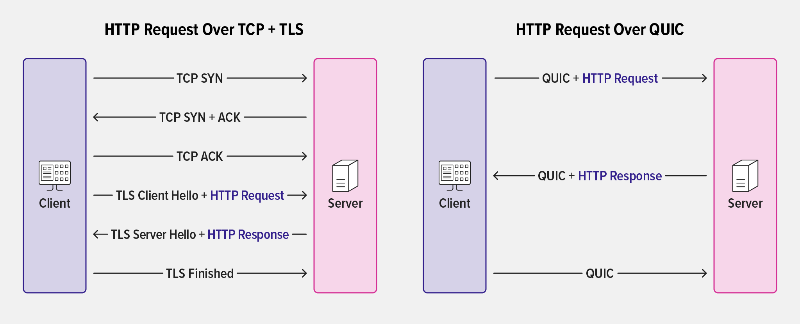

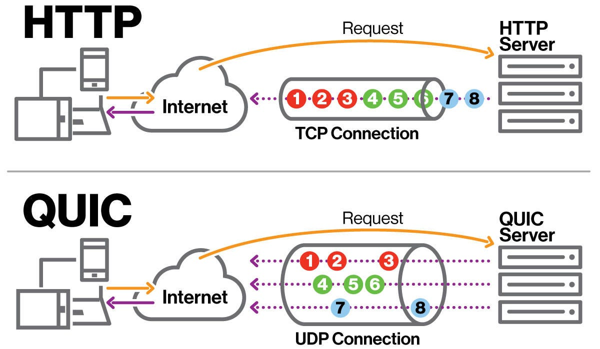

---

# IoT

Dispositivos IoT possuem características diferentes de servidores e aplicações tradicionais.

Podem possuir:

* Pouca memória
* Baixo poder computacional
* Conectividade limitada
* Bateria limitada
* Redes instáveis

Por isso existem protocolos específicos para esse cenário.

---

## MQTT

MQTT (Message Queuing Telemetry Transport) é um protocolo leve de mensageria baseado em publish/subscribe.

```text id="c4m8vy"
Sensor
  |
  | publish
  v
MQTT Broker
  |
  +----------> Consumer A
  |
  +----------> Consumer B
```

O produtor publica uma mensagem em um tópico:

```text id="z8x3kn"
temperature/room1
```

Consumidores interessados nesse tópico recebem a mensagem.

```text id="q4m7sw"
Sensor
  |
  | publish
  v
temperature/room1
  |
  +--> Dashboard
  |
  +--> Alert Service
  |
  +--> Data Storage
```

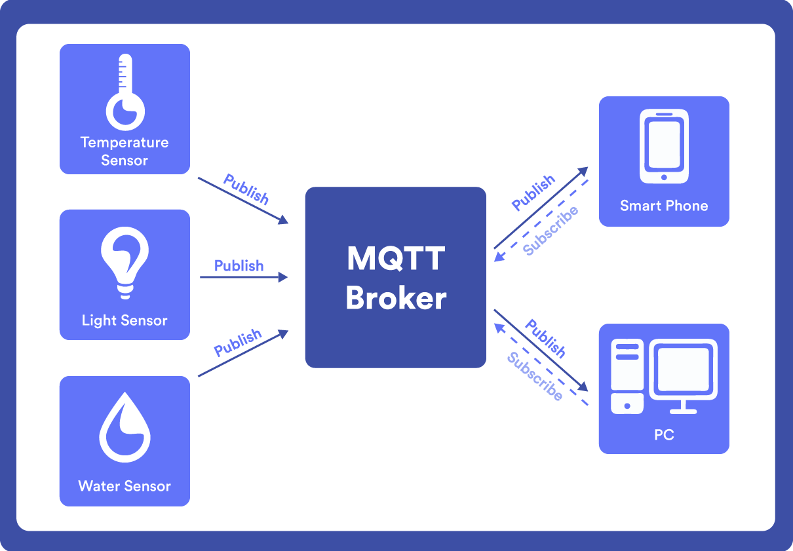

MQTT possui diferentes níveis de **QoS (Quality of Service)**:

* QoS 0 — no máximo uma entrega
* QoS 1 — pelo menos uma entrega
* QoS 2 — exatamente uma entrega dentro das garantias do protocolo

MQTT é comum em:

* Sensores
* Automação
* Smart Home
* Telemetria
* Sistemas industriais
* Dispositivos conectados

---

## CoAP

CoAP (Constrained Application Protocol) é um protocolo desenvolvido para dispositivos e redes com recursos limitados.

Sua estrutura possui algumas semelhanças conceituais com HTTP:

```text id="g8m2pk"
GET
POST
PUT
DELETE
```

Porém, CoAP foi projetado para ambientes mais restritos.

Uma arquitetura pode ser:

```text id="p7c4mx"
IoT Device
    |
    | CoAP
    v
Gateway
    |
    | HTTP / MQTT
    v
Backend
```

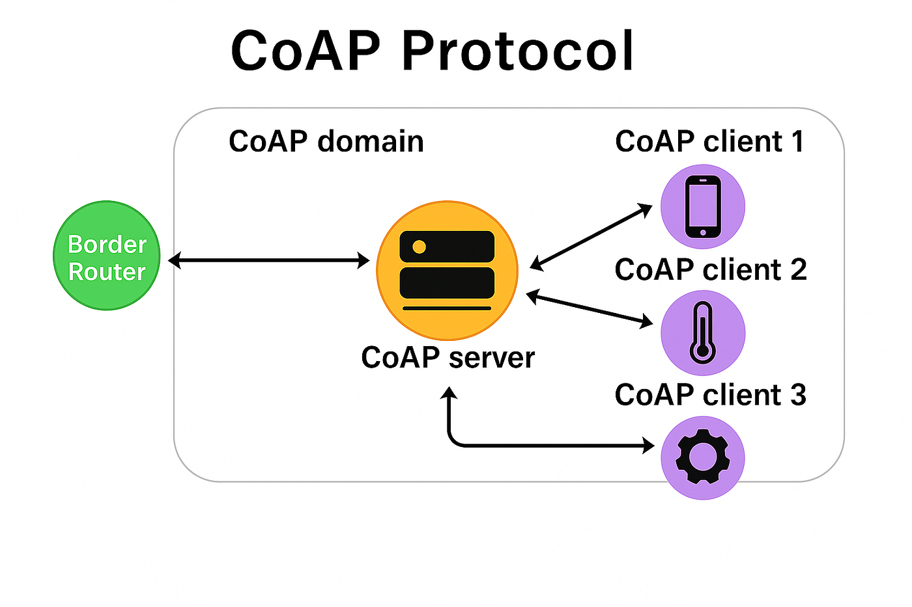

CoAP é especialmente útil quando dispositivos possuem limitações de:

* CPU
* Memória
* Energia
* Largura de banda

---

# Mensageria

## AMQP

AMQP (Advanced Message Queuing Protocol) é um protocolo de mensageria utilizado para comunicação entre sistemas.

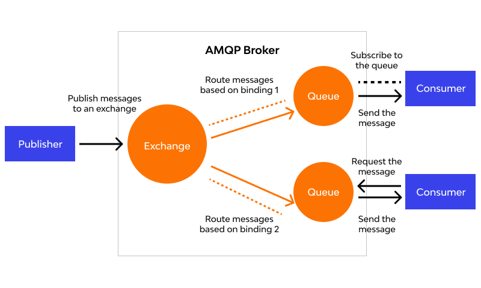

Uma arquitetura comum:

```text id="w4m8pz"
Producer
    |
    | AMQP
    v
Message Broker
    |
    v
Consumer
```

AMQP define conceitos como:

* **Exchanges**: São os pontos de entrada das mensagens. Elas recebem as mensagens do sistema produtor e, com base em regras predefinidas, decidem para quais filas devem direcioná-las. Elas não armazenam mensagens.


* **Queues**: São caixas de armazenamento de mensagens localizadas dentro do broker. Elas guardam as mensagens com segurança até que um sistema consumidor esteja pronto para processá-las.


* **Bindings**: São os links ou "regras de conexão" que você configura para ligar uma Exchange a uma Queue. Eles dizem à Exchange exatamente para onde a mensagem deve ir.


* **Routing keys**: São "etiquetas" ou atributos de endereço que o produtor adiciona à mensagem. A Exchange olha para essa chave e a compara com as regras dos Bindings para saber em qual fila entregar a mensagem.


* **Acknowledgements**: São confirmações de recebimento. O consumidor envia um sinal de volta para o broker informando que a mensagem foi processada com sucesso, permitindo que o broker a delete da fila com segurança e evite perdas.

Por exemplo:

```text id="t8q2mx"
Producer
   |
   v
Exchange
   |
   +--------> Queue A
   |
   +--------> Queue B
                 |
                 v
              Consumer
```

Um broker AMQP pode utilizar regras de roteamento para determinar em quais filas uma mensagem deve ser entregue.

Um exemplo conhecido de implementação é o **RabbitMQ**.

### AMQP vs MQTT

Embora ambos sejam protocolos de mensageria, possuem objetivos diferentes.

| Característica | AMQP                            | MQTT                     |
| -------------- | ------------------------------- | ------------------------ |
| Foco           | Mensageria entre sistemas       | IoT e dispositivos leves |
| Modelo         | Filas e roteamento              | Pub/Sub                  |
| Complexidade   | Maior                           | Menor                    |
| Recursos       | Mais completos                  | Mais leve                |
| Uso comum      | Backend e sistemas corporativos | IoT e telemetria         |

---

# Comparação dos principais protocolos

| Tecnologia | Principal finalidade                              |
| ---------- | ------------------------------------------------- |
| WebRTC     | Comunicação de áudio, vídeo e dados em tempo real |
| ICE        | Encontrar caminhos de conexão                     |
| STUN       | Descobrir endereço externo através de NAT         |
| TURN       | Relay quando conexão direta não é possível        |
| RTP        | Transporte de mídia em tempo real                 |
| RTCP       | Controle e monitoramento do RTP                   |
| SRTP       | RTP com segurança                                 |
| SIP        | Estabelecimento e controle de sessões             |
| RTMP       | Ingestão/transmissão de mídia                     |
| RTSP       | Controle de sessões de streaming                  |
| HLS        | Streaming sobre HTTP                              |
| MPEG-DASH  | Streaming adaptativo sobre HTTP                   |
| QUIC       | Transporte moderno baseado em UDP                 |
| MQTT       | Mensageria leve para IoT                          |
| CoAP       | Comunicação para dispositivos restritos           |
| AMQP       | Mensageria entre sistemas                         |

---

# Escolha da tecnologia

A escolha deve partir do problema que o sistema precisa resolver.

```text id="n8c3qv"
Áudio/vídeo interativo em tempo real?
        |
        +-- Sim → WebRTC

Streaming para muitos usuários?
        |
        +-- Sim → HLS / MPEG-DASH

Câmera IP / controle de streaming?
        |
        +-- Sim → RTSP

Ingestão de vídeo?
        |
        +-- Sim → RTMP

Telefonia / VoIP?
        |
        +-- Sim → SIP + RTP/SRTP

Comunicação com dispositivos IoT?
        |
        +-- Sim → MQTT / CoAP

Mensageria entre aplicações?
        |
        +-- Sim → AMQP

Transporte para aplicações modernas?
        |
        +-- Sim → QUIC / HTTP/3
```

Em um sistema real, várias dessas tecnologias podem coexistir:

```text id="j4m9sx"
                         Internet
                            |
             +--------------+--------------+
             |                             |
          HTTP/3                         WebRTC
             |                             |
             v                             v
          API                      Audio / Video
             |
             v
       Message Broker
             |
       +-----+-----+
       |           |
      AMQP        MQTT
       |           |
       v           v
   Services     IoT Devices
```

A escolha do protocolo deve considerar principalmente:

* Latência
* Throughput
* Confiabilidade
* Modelo de comunicação
* Escalabilidade
* Consumo de recursos
* Compatibilidade
* Segurança
* Infraestrutura necessária

---

## Resumo

```text id="r7m2cx"
Tempo real
  |
  +-- WebRTC
  +-- RTP / RTCP / SRTP
  +-- STUN / TURN / ICE
  +-- SIP

Streaming
  |
  +-- RTMP
  +-- RTSP
  +-- HLS
  +-- MPEG-DASH

Transporte
  |
  +-- QUIC

IoT
  |
  +-- MQTT
  +-- CoAP

Mensageria
  |
  +-- AMQP
```

Esses protocolos aparecem principalmente quando os requisitos do sistema ultrapassam o modelo tradicional de **HTTP + REST + request/response**.

---

<div style="display: flex; justify-content: space-between;">

[← Conceitos importantes](./2.6-important-concepts.md)

[Load Balancing →](../03-load-balancing/3.0-load-balancing-concepts.md)

</div>
